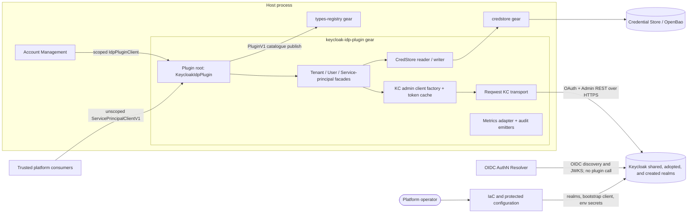
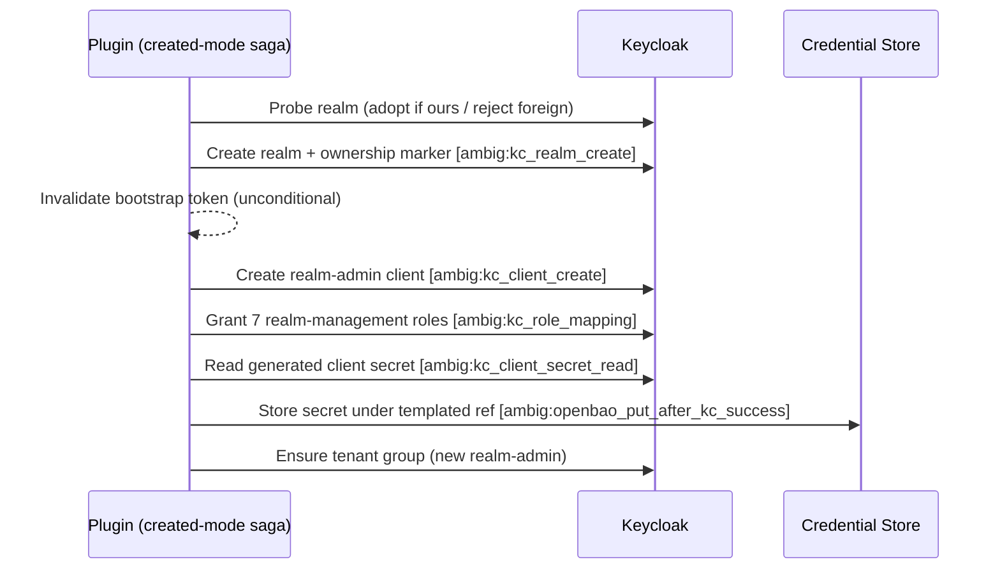
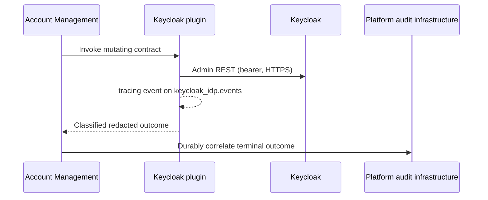

---
refs:
  - PRD.md
  - ../../../docs/DESIGN.md
  - ../../../docs/ADR/0001-cpt-cf-account-management-adr-idp-contract-separation.md
  - ../../../docs/ADR/0005-cpt-cf-account-management-adr-idp-user-identity-source-of-truth.md
  - ../../../docs/ADR/0006-cpt-cf-account-management-adr-idp-user-tenant-binding.md
---

# Technical Design — Keycloak IdP Plugin

- [ ] `p3` - **ID**: `cpt-cf-keycloak-idp-plugin-design-keycloak-idp-plugin`

**Owners:** @platform-iam-team

**Scope:** Architecture of the Keycloak IdP plugin (crate `cf-gears-keycloak-idp-plugin`), which is delivered in a separate change; this document and the adjacent PRD ship first. The implementation is authoritative; this document describes what the code does, deliberately mirroring implementation-level constants and behaviors (an implementation-mirror altitude) — a change to those constants in code owns the matching edit here. In-code comments citing `DESIGN §N` refer to the implementation specification this crate lineage descends from, not to section numbers in this document.

<!-- toc -->

- [1. Architecture Overview](#1-architecture-overview)
  - [1.1 Architectural Vision](#11-architectural-vision)
  - [1.2 Architecture Drivers](#12-architecture-drivers)
  - [1.3 Architecture Layers](#13-architecture-layers)
- [2. Principles & Constraints](#2-principles--constraints)
  - [2.1 Design Principles](#21-design-principles)
  - [2.2 Constraints](#22-constraints)
  - [2.3 Applicability Matrix](#23-applicability-matrix)
- [3. Technical Architecture](#3-technical-architecture)
  - [3.1 Domain Model](#31-domain-model)
  - [3.2 Component Model](#32-component-model)
  - [3.3 API Contracts](#33-api-contracts)
  - [3.4 Internal Dependencies](#34-internal-dependencies)
  - [3.5 External Dependencies](#35-external-dependencies)
  - [3.6 Interactions & Sequences](#36-interactions--sequences)
  - [3.7 Database schemas & tables](#37-database-schemas--tables)
- [4. Additional context](#4-additional-context)
  - [4.1 Security and Data Protection](#41-security-and-data-protection)
  - [4.2 Verification Architecture](#42-verification-architecture)
  - [4.3 Risks and Enablement Gates](#43-risks-and-enablement-gates)
- [5. Traceability](#5-traceability)
  - [5.1 Authoritative Contracts](#51-authoritative-contracts)
  - [5.2 P1 Requirement Allocation](#52-p1-requirement-allocation)

<!-- /toc -->

The adjacent [PRD](./PRD.md) is authoritative for WHAT, WHY, release priority, actors, and acceptance criteria. The Account Management SDK is authoritative for request, result, failure, filtering, ordering, and cursor contracts; the service-principal SDK is authoritative for the machine-identity contract. This document defines the architecture of the shipped implementation and its safety invariants.

## 1. Architecture Overview

### 1.1 Architectural Vision

The Keycloak IdP plugin is a provider adapter running as an in-process ToolKit gear (`keycloak-idp-plugin`) in the host process next to Account Management. It implements two ClientHub contracts:

- `account_management_sdk::idp::IdpPluginClient` — tenant and user identity lifecycle, registered **scoped** under its GTS catalogue instance id so Account Management selects it by vendor/priority.
- `service_principal_sdk::ServicePrincipalClientV1` — tenant-scoped machine identities (confidential OAuth `client_credentials` clients), registered **unscoped** for trusted platform consumers.

The plugin talks to the Keycloak Admin REST and OAuth token endpoints directly over HTTPS (reqwest transport). It authenticates with OAuth2 `client_credentials` using two administrator tiers: a **bootstrap admin** client (in the `master` realm by default, secret supplied via environment-expanded configuration) for realm-level work, and a per-realm **realm-admin** client for tenant/user work inside a bound realm. Realm-admin secrets are environment-backed for the default shared realm and Credential-Store-backed (OpenBao) for adopted and created realms; the plugin reads and — for realms it creates — writes those secrets itself through `credstore-sdk` under a plugin-owned system security context.

Three realm bindings are supported: `shared` (default; tenants share an operator-provisioned realm), `adopted` (an existing empty operator realm bound to one tenant), and `created` (the plugin creates and lifecycle-manages a dedicated realm — generated as `realm-{tenant_id}` for child tenants, while a root-target created realm requires an explicit operator-supplied name). Keycloak remains the user source of truth; the plugin persists nothing locally and returns a versioned opaque metadata envelope that Account Management stores and replays.

`update_user` is intentionally not implemented in this revision: the plugin inherits the SDK default, which returns `IdpUserOperationFailure::UnsupportedOperation`.

### 1.2 Architecture Drivers

| Driver | Design allocation |
|---|---|
| Provider-neutral publication and selection | `PluginV1<IdpPluginSpecV1>` published to types-registry (instance segment `cf.builtin.keycloak_idp.plugin.v1`; full catalogue id in §3.2, vendor `keycloak`, priority 50); scoped ClientHub registration keyed on the instance id; AM resolves via `choose_plugin_instance` against `idp.vendor` |
| Fail-fast configuration errors | Init validates typed config (`deny_unknown_fields`), the `secret_ref_template`, and the service-principal section, then pre-warms the bootstrap admin token with a bounded retry budget; exhausting the budget fails `Gear::init` |
| Shared-realm tenant isolation | Per-tenant Keycloak group under `/tenants`, immutable `tenant_id` user attribute (ADR-0006), and an ownership marker attribute (`cf.provisioning.tenant_id`) on created realms and service-principal clients |
| Safe external mutation | Parse-then-probe saga ordering, per-step reactive-401 wrapping, idempotent replay paths (probe-adopt realm ensure, 409 group reuse), and stage-attributed `AmbiguousCreated` classification with an `ambig:` prefix contract for reconciliation tooling |
| Secret custody | `SecretFromEnv`/`SecretString` wrappers with redacted `Debug`, token cache redaction, `redact_secrets` on every error body, and Credential Store writes only for plugin-created realm-admin secrets |
| Credential rotation without restart | Token cache keyed `(realm, client_id)` with single-flight refresh and an exactly-once reactive-401 retry that re-resolves the secret from its source (env or Credential Store) |
| User query correctness | Full tenant-group member drain (hard cap 10,000) sorted `(createdTimestamp ASC, id ASC)`, client-side typed filters, `CursorV1` continuation with an FNV-1a filter hash |
| Observability | Segregated metric ports over one OTel adapter (`keycloak_idp_plugin_*` instruments), realm-label cardinality cap, and structured audit events on the `keycloak_idp.events` tracing target |

#### NFR Allocation

| NFR | Architectural response | Release verification |
|---|---|---|
| Tenant isolation | Tenant group membership scopes listing; the `tenant_id` user attribute guards user deprovision; `cf.provisioning.tenant_id` markers guard realm and service-principal ownership | Negative-isolation unit and integration tests |
| Secret non-disclosure | Typed secret wrappers, redacted token cache, `redact_secrets` + 2 KiB truncation on every provider error body before it crosses the AM boundary | Redaction unit tests; log/metric scanning |
| Failure classification | Closed `PluginError` taxonomy translated at the SDK boundary per fixed tables; `debug_assert` that provisioning never surfaces `MetadataDecode` | Exhaustive translation unit tests and failure injection |
| Availability recovery | Per-call pre-saga health probe; reactive-401 secret re-resolution; no cached provider state besides tokens; recovery needs no restart once init has succeeded | Dependency loss/recovery tests |
| Personal-data lifecycle | No local user directory; user deprovision deletes the provider identity; audit events carry provider IDs plus `username` only on `user.provisioned` | Hard-delete and output-minimization tests |
| Lifecycle latency | Bounded per-request HTTP timeout (5 s default), bounded retry policy, 30 s provision/deprovision saga timeout, list drain cap | Release qualification profile per PRD §6.1 |

#### Decision Provenance

The significant decisions inherit these accepted records and standards:

- [Separate Account Management from the IdP provider](../../../docs/ADR/0001-cpt-cf-account-management-adr-idp-contract-separation.md).
- [Keep the IdP as user source of truth](../../../docs/ADR/0005-cpt-cf-account-management-adr-idp-user-identity-source-of-truth.md).
- [Use provider-enforced tenant binding](../../../docs/ADR/0006-cpt-cf-account-management-adr-idp-user-tenant-binding.md) — implemented as the `tenant_id` user attribute plus tenant-group membership.
- Follow [ClientHub and plugin scoping](../../../../../../docs/toolkit_unified_system/03_clienthub_and_plugins.md), [lifecycle rules](../../../../../../docs/toolkit_unified_system/08_lifecycle_stateful_tasks.md), the [Architecture Manifest](../../../../../../docs/ARCHITECTURE_MANIFEST.md), and [Security Guidelines](../../../../../../guidelines/SECURITY.md).

Durable audit delivery remains owned by Account Management and the platform audit owner. The plugin's structured-event emitters (`keycloak_idp.events`) are an explicit development stand-in until the platform audit sink lands.

### 1.3 Architecture Layers

- [ ] `p3` - **ID**: `cpt-cf-keycloak-idp-plugin-tech-inprocess-gear-stack`

| Layer | Responsibility |
|---|---|
| Module wiring (`module.rs`) | Config probe/expansion, static validation, bootstrap token pre-warm, facade construction, types-registry publication, ClientHub registration |
| Plugin root (`idp_impl.rs`, `sp_impl.rs`) | SDK trait implementations, metadata encode, `PluginError` → SDK failure translation |
| Domain facades | Tenant/user/service-principal sagas, boundary enforcement, replay safety, error classification, audit emission |
| KC client layer (`domain/kc`) | Token acquisition and caching, single-flight refresh, reactive-401, admin REST helpers |
| Credential Store wrappers (`domain/credstore`) | System-context-bound read (secrets, CA bundle) and write (created-realm admin secrets) |
| Infrastructure (`infra`) | Reqwest transport with retry/backoff/Retry-After, TLS CA bundle wiring, OTel metrics adapter |

## 2. Principles & Constraints

### 2.1 Design Principles

#### Explicit provider intent

- [ ] `p3` - **ID**: `cpt-cf-keycloak-idp-plugin-principle-explicit-provider-intent`

Provisioning intent is parsed fail-closed (`deny_unknown_fields`); an unknown mode or contradictory realm intent is rejected before any provider call. Absent intent defaults to `shared`, where a child tenant inherits its parent's realm from replayed metadata rather than guessing.

#### Two-factor tenant binding

- [ ] `p3` - **ID**: `cpt-cf-keycloak-idp-plugin-principle-two-factor-tenant-binding`

Tenant-group membership scopes queries; the immutable `tenant_id` user attribute guards destructive user operations. A mismatch performs no mutation and follows non-disclosing absence semantics.

#### Operator-owned realms stay operator-owned

- [ ] `p3` - **ID**: `cpt-cf-keycloak-idp-plugin-principle-operator-owned-realm`

Shared and adopted realms are asserted, never created, repaired, or deleted. Only `created`-mode realms — marked with the plugin's ownership attribute — are created and, on last-tenant deprovisioning, deleted. A realm without the plugin's ownership marker is never touched.

#### Correctness before retry

- [ ] `p3` - **ID**: `cpt-cf-keycloak-idp-plugin-principle-correctness-before-retry`

Automatic HTTP retry splits by what is known. A retryable status (5xx/429) means Keycloak answered: bounded retry applies to all methods — including administrative `POST`s, whose replays converge through the idempotent-ensure and 409-reuse paths. A connect or timeout failure means the outcome is unknown: only idempotent requests (GET/PUT/DELETE and the token form-POST) are replayed, and administrative `POST`s never are. Reactive-401 re-mints exactly once because an auth rejection provably had no side effect. Uncertain created-mode work is stage-attributed `AmbiguousCreated`, never a clean failure.

#### SDK authority

- [ ] `p3` - **ID**: `cpt-cf-keycloak-idp-plugin-principle-sdk-authority`

DTOs, cursors, and failure vocabularies come from `account-management-sdk` and `service-principal-sdk`. The plugin adds no parallel public contract.

#### No silent success

- [ ] `p3` - **ID**: `cpt-cf-keycloak-idp-plugin-principle-no-silent-success`

Unsupported operations (`update_user`, unsupported filters) return typed `UnsupportedOperation` failures. Truncated list drains are logged loudly. Already-absent resources are explicit success-equivalents, not silent no-ops.

#### Least privilege by tier

- [ ] `p3` - **ID**: `cpt-cf-keycloak-idp-plugin-principle-least-privilege`

Realm-scoped work uses a per-realm admin client granted exactly seven `realm-management` roles (`view-realm`, `view-clients`, `query-groups`, `manage-realm`, `manage-users`, `query-users`, `manage-clients`). The bootstrap admin is used only where realm-level authority is required: realm existence probes, created-realm lifecycle, service-principal client administration, and the tenant-group emptiness and sibling probes on adopted and created realms — which is why the bootstrap client also needs `query-groups` on those realms.

#### Privacy-preserving evidence

- [ ] `p3` - **ID**: `cpt-cf-keycloak-idp-plugin-principle-privacy-preserving-evidence`

Metrics labels are closed enums plus a cardinality-capped realm label; no metric carries a profile value or secret. Error bodies are redacted and truncated to 2 KiB before crossing the boundary. Audit events carry provider IDs; `user.provisioned` additionally records the username as operational evidence.

#### Durable audit stays upstream

- [ ] `p3` - **ID**: `cpt-cf-keycloak-idp-plugin-principle-durable-audit-intent`

The plugin returns one classified outcome per call and emits structured stand-in events; durable, idempotent audit persistence belongs to Account Management and the platform audit owner.

### 2.2 Constraints

#### Init-time provider dependency

- [ ] `p3` - **ID**: `cpt-cf-keycloak-idp-plugin-constraint-init-pre-warm`

When enabled, the plugin fails `Gear::init` if the bootstrap admin token cannot be acquired within the configured pre-warm budget (default 5 attempts × 3 s backoff, ≈37 s worst case including attempt time). Transient failures (5xx/429/transport/timeout, Credential Store readiness) are retried within the budget; permanent failures (non-429 4xx, malformed configuration) fail fast. Deployments that must start without Keycloak set `enabled: false`.

#### External consistency boundaries

- [ ] `p3` - **ID**: `cpt-cf-keycloak-idp-plugin-constraint-external-consistency-boundaries`

Keycloak and the Credential Store are external consistency boundaries. Plugin calls occur outside Account Management database transactions; the architecture does not claim atomic commit across them. Created-mode provisioning has an explicit point of no return: after Keycloak state exists, a failed Credential Store write is `AmbiguousCreated { OpenBaoPutAfterKcSuccess }`, never clean.

#### External durable audit prerequisite

- [ ] `p3` - **ID**: `cpt-cf-keycloak-idp-plugin-constraint-durable-audit-wrapper`

The plugin owns no audit table, recovery worker, relay, or sink integration. Its `tracing`-based event emitters are a development stand-in. Production requires the parent Account Management design and platform audit contract to guarantee durable call/outcome correlation.

#### Opaque metadata replay

- [ ] `p3` - **ID**: `cpt-cf-keycloak-idp-plugin-constraint-opaque-metadata-replay`

Account Management persists the plugin's metadata envelope as opaque JSON and replays it on later calls. Decoding is fail-closed: a missing `version`, a version other than `"v1"`, or a malformed shape yields a typed failure without provider access. The envelope carries no secrets — only routing identifiers and a Credential Store reference name.

#### No plugin persistence

- [ ] `p3` - **ID**: `cpt-cf-keycloak-idp-plugin-constraint-no-plugin-persistence`

The plugin owns no database table and no persistent user cache. Its only in-memory state is the admin token cache and metrics cardinality tracking.

#### Scoped provider selection

- [ ] `p3` - **ID**: `cpt-cf-keycloak-idp-plugin-constraint-scoped-provider-selection`

Account Management selects the plugin through the types-registry catalogue instance and scoped ClientHub resolution. On restart the plugin re-registers idempotently: an `AlreadyExists` catalogue answer is accepted only when the stored spec is structurally equal JSON to the current registration (key order and formatting are irrelevant; any field-value difference fails init).

#### Bounded offline-token exposure

- [ ] `p3` - **ID**: `cpt-cf-keycloak-idp-plugin-constraint-bounded-offline-token-exposure`

A previously issued access JWT can remain valid until `exp`. The plugin revokes sessions on user deprovisioning (best-effort, configurable) but never claims real-time token invalidation; bounding exposure is an operator realm-policy obligation (15-minute access-token lifetime per the PRD).

#### Bounded query scan

- [ ] `p3` - **ID**: `cpt-cf-keycloak-idp-plugin-constraint-correct-global-query-ordering`

Keycloak does not guarantee stable ordering across group-member offset pages, so `list_users` drains the entire tenant-group membership per request (pages of `list_users_page_limit_max`, default 200), sorts globally on `(createdTimestamp, id)`, and filters client-side. The drain is bounded by a 10,000-member hard cap: it stops after the first page that reaches the cap (bounded overshoot of at most one fetch page) and logs a loud truncation warning. Page size to the caller is capped at 200.

### 2.3 Applicability Matrix

| Checklist domain | Disposition |
|---|---|
| Architecture and semantic alignment | Applicable; addressed in §§1–3 and §5. |
| Performance and capacity | Applicable; query scan bounds, timeouts, and retry budgets are addressed in §§2.2 and 3.6. |
| Security and compliance controls | Applicable; trust boundaries and controls are addressed in §4.1. |
| Reliability | Applicable; mutation uncertainty, replay, timeout, and recovery are addressed in §3.6. |
| Data | Applicable only to ownership and lifecycle because the plugin owns no database; addressed in §§3.1, 3.7, and 4.1. |
| Integration | Applicable; Account Management, Keycloak, Credential Store, types-registry, and ClientHub boundaries are addressed in §§3.2–3.6. |
| Operations | Applicable; configuration, observability, and enablement gates are addressed in §§3.2, 3.6, and 4.3. |
| Maintainability | Applicable; SDK authority, component boundaries, and decision provenance are addressed in §§1.2, 2.1, and 3.2–3.4. |
| Testing | Applicable; verification architecture is addressed in §4.2. |
| Usability | Not applicable because the plugin exposes no human interface. |
| Accessibility | Not applicable because the plugin exposes no visual or interactive user interface. |
| Business and time-to-market | Not applicable; owned by the adjacent PRD and planning artifacts. |
| Plugin-specific cost budget | Not applicable because the plugin adds no independently deployed service or plugin-owned store. |
| Documentation quality | Applicable; authoritative references and traceability are provided in §5. |

## 3. Technical Architecture

### 3.1 Domain Model

#### Tenant IdP metadata envelope

- [ ] `p3` - **ID**: `cpt-cf-keycloak-idp-plugin-entity-tenant-idp-metadata`

The provider metadata is the versioned, non-secret routing envelope `TenantIdpMetadataV1` (Rust type and serde shape defined in the crate's `domain/metadata_codec.rs`), owned by the plugin and persisted opaquely by Account Management:

| Field | Meaning |
|---|---|
| `version` | Envelope version; `"v1"` at this revision. Missing → `MissingVersion`; other values → `UnsupportedVersion`; shape mismatch → `Malformed`. All three fail closed before provider access. |
| `realm_name` | Realm the tenant is bound to. |
| `realm_binding` | `shared` \| `adopted` \| `created` (also a public metric label). |
| `tenant_group_id` | Keycloak UUID of the plugin-owned per-tenant group. |
| `admin_secret_ref` | `None` for the env-backed default shared realm; `Some(ref)` naming the Credential Store reference for adopted/created realms (template `keycloak-idp-realm-admin-{realm_name}-secret` by default). |
| `admin_client_id` | OAuth2 `client_id` of the per-realm admin client (default `keycloak-idp-plugin-realm-admin`). |

Provider ownership is split as follows:

| Resource | Owner | Plugin authority |
|---|---|---|
| Shared and adopted realms, their authentication profile, protocol mappers, and the bootstrap/realm-admin clients in them | Platform operator (IaC / realm bootstrap) | Assert existence (and emptiness for adopted); use the configured admin clients |
| Created realms (child tenants: generated `realm-{tenant_id}`; root target: operator-named; all marked `cf.provisioning.tenant_id`) | Plugin | Create, administer, and delete on last-tenant deprovisioning |
| Realm-admin client and its 7 `realm-management` roles in created realms | Plugin | Create and grant during created-mode provisioning |
| Per-tenant group under `/tenants` and the `tenant_id`/`user_type` user attributes | Plugin | Create, inspect, delete for the owning tenant |
| Human identities and sessions in the tenant boundary | Plugin through Account Management | Create, delete, revoke, and query after boundary verification; updates are unsupported in this revision |
| Service-principal clients `svc-{tenant_id}-{name}` and their service-account users | Plugin through `ServicePrincipalClientV1` | Create, rotate, revoke, list, and purge on tenant deprovisioning |
| Created-realm admin secret in the Credential Store | Plugin (system actor) | Write on provisioning, read on later calls, delete on realm teardown |
| Shared/adopted realm-admin secrets | Platform operator | Read only (env expansion or Credential Store reference) |
| Opaque provider metadata row | Account Management | Persist/replay only; plugin owns interpretation |
| Access-token validation | OIDC AuthN Resolver | No call to this plugin |

### 3.2 Component Model

#### Keycloak IdP plugin

- [ ] `p3` - **ID**: `cpt-cf-keycloak-idp-plugin-component-keycloak-idp-plugin`

The plugin is one logical architecture component. The following entries are responsibility partitions inside that component (concrete Rust modules), not independently deployed services.

| Responsibility partition | Module | Architectural responsibility |
|---|---|---|
| Module wiring | `module.rs` | Enabled probe, typed config expansion, static validation, bootstrap pre-warm, DI, catalogue publish, ClientHub registration |
| Plugin root | `idp_impl.rs`, `sp_impl.rs` | SDK trait surface; failure translation tables |
| Tenant lifecycle coordinator | `domain/tenant_facade.rs` | Provision/deprovision sagas for all three bindings, saga timeout, idempotent replay, ambiguity staging, service-principal purge hook |
| User lifecycle coordinator | `domain/user_facade.rs` | User provision/deprovision/list, tenant boundary guard, orphan compensation, cursor pagination |
| Service-principal facade | `domain/service_principal_facade.rs` | Machine-identity lifecycle against the configured service-principal realm (`service_principal.realm`, default `platform`); ownership markers; quota and scope allowlist |
| Metadata codec | `domain/metadata_codec.rs` | Versioned fail-closed envelope encode/decode |
| KC admin client factory | `domain/kc/` | `client_credentials` token acquisition, `(realm, client_id)` token cache with single-flight refresh, reactive-401, health probe |
| Credential Store wrappers | `domain/credstore/` | System-ctx-bound reader (secrets, CA bundle) and writer (create-or-replace, delete with absent-as-success) |
| Transport | `infra/kc_http.rs` | Reqwest HTTPS client, per-request timeout, bounded retry with exponential backoff + full jitter + `Retry-After`, W3C trace propagation, body redaction/truncation |
| Observability | `infra/metrics.rs`, `domain/audit.rs`, `domain/ports/` | One OTel adapter behind seven segregated metric ports; structured audit emitters |
| System actor | `domain/system_actor.rs` | Stable plugin service-principal identity for Credential Store calls |

#### Deployment, Publication, and Readiness

The plugin is an in-process gear (gear name `keycloak-idp-plugin`, with declared gear dependencies on `types-registry` and `credstore`) in each host replica. It opens no listener and owns no independent deployment or database.

Initialization proceeds in phases:

1. **Enabled probe** — `enabled` (default `true`) is read leniently; a disabled plugin skips everything else and registers nothing.
2. **Typed config expansion** — `${VAR}` substitution over the marked secret fields; unknown keys are rejected.
3. **Static validation** — the `secret_ref_template` is validated by interpolating a 64-character synthetic realm name through `SecretRef::new`; the service-principal section is validated.
4. **Transport construction** — the reqwest client is built; if `tls_ca_bundle_ref` is set, the PEM bundle is read from the Credential Store and added as a root certificate.
5. **Bootstrap pre-warm** — the bootstrap admin token is acquired with bounded retry (default 5 × 3 s). Retryable causes: 5xx/429/transport/timeout and Credential Store read failures (deploy-ordering races). Permanent causes fail on the first attempt. Budget exhaustion fails init.
6. **Catalogue publish** — `PluginV1<IdpPluginSpecV1>` is registered with types-registry under the full catalogue instance id `gts.cf.toolkit.plugins.plugin.v1~cf.core.idp.plugin.v1~cf.builtin.keycloak_idp.plugin.v1` (base plugin type `gts.cf.toolkit.plugins.plugin.v1~`, derived IdP spec type `…~cf.core.idp.plugin.v1~`, instance segment `cf.builtin.keycloak_idp.plugin.v1`), carrying the configured vendor/priority. `AlreadyExists` is accepted only when the stored spec is structurally equal JSON to the current registration.
7. **ClientHub registration** — `Arc<dyn IdpPluginClient>` scoped by the catalogue instance id; `Arc<dyn ServicePrincipalClientV1>` unscoped.

After init, readiness is operation-based: every tenant provision/deprovision saga begins with an unauthenticated Keycloak health probe (`GET realms/master`), and every call re-resolves credentials on 401. Recovery from provider or Credential Store outages therefore needs no process restart.

### 3.3 API Contracts

The current [`idp.rs`](../../../account-management-sdk/src/idp.rs) and [`idp_user.rs`](../../../account-management-sdk/src/idp_user.rs) contracts are authoritative for tenant/user work; [`service-principal-sdk`](../../../../service-principal/service-principal-sdk/src/api.rs) is authoritative for machine identities. This boundary realizes the PRD interface contracts `cpt-cf-keycloak-idp-plugin-interface-idp-plugin-client`, `cpt-cf-keycloak-idp-plugin-interface-service-principal-client`, and `cpt-cf-keycloak-idp-plugin-interface-provider-instance`, under the external contracts `cpt-cf-keycloak-idp-plugin-contract-account-management`, `cpt-cf-keycloak-idp-plugin-contract-keycloak-admin`, and `cpt-cf-keycloak-idp-plugin-contract-credstore`.

Contract invariants implemented at the boundary (`idp_impl.rs`, `sp_impl.rs`):

- malformed or contradictory provisioning intent (`ProvisionInputRejected`, metadata decode failures) maps to `IdpProvisionFailure::InvalidInput` with `field = "provisioning_metadata"`, before provider mutation;
- a foreign or unmarked existing realm in `created` mode is `CleanFailure` (no state was created); permanent provider 4xx and pre-saga failures are `CleanFailure`;
- provider 5xx, transport/timeout, saga timeout, and every staged `AmbiguousCreated` map to `IdpProvisionFailure::Ambiguous` for the provisioning reaper;
- missing bootstrap permissions (`BootstrapPermsMissing`) map to `UnsupportedOperation` with an operator-runbook detail;
- tenant deprovisioning maps `DeprovisionNotFound` → `NotFound` (success-equivalent), `DeprovisionRetryable` → `Retryable`, and everything else — including metadata decode failures — → `Terminal`;
- user failures use only `IdpUserOperationFailure` variants: KC 409 on create is `DuplicateUser` with the field refined from the provider message (`Username`/`Email`/`UsernameOrEmail`), password-policy rejections are `PasswordPolicy`, unsupported filters and the unimplemented `update_user` are `UnsupportedOperation`, provider/transport trouble is `Unavailable`;
- service-principal failures use the closed `ServicePrincipalFailure` set: `InvalidInput` (bad name, disallowed scope, quota, taken client id), `NotFound` (absent or foreign principal — indistinguishable by design), `Ambiguous` (stage-attributed transport uncertainty; stage tokens tabulated in §3.6), `CleanFailure` (pre-mutation failures);
- every mutating return carries redacted, truncated, grep-friendly detail: provider failures use `kc:{METHOD} {path_template} -> {status}: {body≤2KiB}`, internal component failures `internal:{component}: …`, and classified domain rejections a stable variant prefix (`ambig:{stage}: …`, `deprovision retryable: …`, `sp invalid input: …`, and so on).

The plugin emits no public HTTP API.

### 3.4 Internal Dependencies

Domain components depend on plugin-owned ports rather than transport types: `reqwest` is confined to `infra/kc_http.rs` behind the `KcTransport` trait, and metrics are consumed through seven segregated port traits implemented by one adapter.

| Internal dependency | Purpose |
|---|---|
| Account Management SDK | Provider-neutral trait, DTO, failure, and pagination authority |
| Service-principal SDK | Machine-identity trait, models, and failure taxonomy |
| ToolKit and ClientHub | Gear lifecycle, config expansion, scoped publication and dependency resolution |
| types-registry SDK + gear | `PluginV1` catalogue publication (hard init prerequisite) |
| credstore SDK + gear | Secret read/write under the plugin system actor |
| `toolkit-odata` | `CursorV1` continuation-token envelope |

### 3.5 External Dependencies

| Dependency | Contract and failure boundary |
|---|---|
| Account Management | Authorizes calls, selects the scoped plugin, persists/replays opaque metadata, consumes typed outcomes, owns durable audit |
| Keycloak | User/session/group/client source of truth; Admin REST + OAuth token endpoints reached directly over HTTPS; per-request timeout 5 s (default), bounded retry for idempotent requests |
| Credential Store (OpenBao-backed) | Custody of adopted/created realm-admin secrets and the optional TLS CA bundle; written by the plugin only for created realms; unavailability blocks affected operations and init when the CA bundle or pre-warm needs it |
| Operator IaC / realm bootstrap | Provides shared/adopted realms, their authentication profile and protocol mappers (including the `tenant_id`/`user_type` usermodel-attribute mappers), the bootstrap admin client and its secret, shared-realm admin client and secret, adopted-realm secrets under the template reference, and realm-default client scopes for service principals |
| OIDC AuthN Resolver | Independently validates tokens; consumes the `user_type`/`tenant_id` claims the realm mappers project; the two components never call each other |
| Trusted platform consumers | Resolve `ServicePrincipalClientV1` from ClientHub; their own RBAC/PDP authorizes calls before delegation |

### 3.6 Interactions & Sequences

#### Realm Binding and Tenant Provisioning

**ID**: `cpt-cf-keycloak-idp-plugin-seq-tenant-provisioning`

**Use cases**: `cpt-cf-keycloak-idp-plugin-usecase-bind-shared-tenant`, `cpt-cf-keycloak-idp-plugin-usecase-adopt-tenant-realm`, `cpt-cf-keycloak-idp-plugin-usecase-create-tenant-realm` — **Actors**: `cpt-cf-keycloak-idp-plugin-actor-account-management`, `cpt-cf-keycloak-idp-plugin-actor-keycloak`, `cpt-cf-keycloak-idp-plugin-actor-credstore`, `cpt-cf-keycloak-idp-plugin-actor-platform-operator`

`provision_tenant` runs under a 30 s (configurable) timeout; a timeout is `AmbiguousCreated { Timeout }`. The saga parses intent first (fail-fast, no provider round-trip), then health-probes Keycloak (failure = clean `Config` error — nothing mutated), then dispatches on the binding:

- **Shared** (default; child tenants inherit the parent's realm from replayed parent metadata; root bootstrap must name the realm): assert the realm exists (bootstrap admin), then under the env-backed realm-admin ensure the per-tenant group `/tenants/{tenant_id}` and optionally bind the operator-declared admin user's `tenant_id`/`user_type` attributes (idempotent; a foreign or multi-valued existing binding is rejected as a hijack attempt).
- **Adopted**: assert the realm exists and is empty of tenant boundaries (no subgroups under the group root), then ensure the tenant group using the operator-provisioned Credential Store secret reference.
- **Created** (child tenants use the generated name `realm-{tenant_id}` and reject an explicit one; a root-target created realm requires an explicit operator-supplied name): idempotent realm ensure (probe → adopt if marked as ours → reject foreign → create with the ownership attribute and a fail-closed allowlist over operator `realm_defaults`: `displayNameHtml`, `defaultLocale`, `supportedLocales`, `internationalizationEnabled`), unconditional bootstrap-token invalidation after realm ensure — whether the realm was just created or idempotently adopted — so the next bootstrap call carries the new realm's auto-granted role, realm-admin client creation, grant of the seven `realm-management` roles, secret read-back, Credential Store write (point of no return — failure is `AmbiguousCreated { OpenBaoPutAfterKcSuccess }`), and tenant-group creation under the new realm-admin.

Every step that can fail after provider state exists carries a stage token that reconciliation tooling parses by its `ambig:` prefix. The complete stage contract (one row per `AmbiguousStage` variant):

| Stage token | Emitting saga |
|---|---|
| `ambig:kc_realm_create` | Created-mode realm creation |
| `ambig:kc_client_create` | Created-mode realm-admin client creation; service-principal client creation and post-create lookup |
| `ambig:kc_role_mapping` | Created-mode `realm-management` role grants |
| `ambig:kc_client_secret_read` | Created-mode realm-admin secret read-back; service-principal secret read at creation |
| `ambig:openbao_put_after_kc_success` | Created-mode Credential Store write after Keycloak state exists |
| `ambig:admin_user_bind` | Shared-mode admin-user attribute bind |
| `ambig:timeout` | Provisioning saga timeout |
| `ambig:kc_sa_attr_set` | Service-principal service-account attribute bind after client creation |
| `ambig:kc_client_scope_attach` | Service-principal client-scope attachment |
| `ambig:kc_client_secret_rotate` | Service-principal secret rotation |
| `ambig:kc_client_delete` | Service-principal revocation and tenant-deprovision purge |

Success returns the metadata envelope, records `provision_tenant_duration` and `realms_bound`, and emits `tenant.bound` (plus `realm.created` and/or `admin_user.bound` where applicable).

#### User Mutation Safety

**ID**: `cpt-cf-keycloak-idp-plugin-seq-user-mutation`

**Use cases**: user provisioning/deprovisioning are exercised through the parent Account Management use cases; `cpt-cf-keycloak-idp-plugin-usecase-update-user` is p2 — **Actors**: `cpt-cf-keycloak-idp-plugin-actor-tenant-admin`, `cpt-cf-keycloak-idp-plugin-actor-account-management`, `cpt-cf-keycloak-idp-plugin-actor-keycloak`

User operations resolve realm, admin client, and tenant group from replayed metadata and run each Keycloak step under an exactly-once reactive-401 wrapper.

*Provisioning* creates the user with `enabled = true`, the immutable `tenant_id` and `user_type = "user"` attributes, configured required actions (default `VERIFY_EMAIL`; `UPDATE_PASSWORD` added for temporary passwords), `emailVerified` derived as the complement of `VERIFY_EMAIL`, and an optional embedded initial password; then resolves the created UUID by exact username lookup and joins the user to the tenant group. A failed group join triggers best-effort orphan compensation (delete the just-created user) with a dedicated outcome metric; the original error is always the one returned. Duplicate detection: any 409 from user-create is `DuplicateUser`; the offending field is refined from the provider error message when possible.

*Deprovisioning* first reads the target user's stored `tenant_id` attribute; a mismatch against the request tenant performs no mutation and returns success-equivalently (non-disclosing, per ADR-0006 — this attribute check is the cross-tenant deletion guard). It then best-effort revokes sessions (configurable, default on) and deletes the identity; 404/410 are success-equivalent.

*Updates* are not implemented: the SDK default returns `UnsupportedOperation`.

#### Tenant Deprovisioning

**ID**: `cpt-cf-keycloak-idp-plugin-seq-hard-tenant-deprovisioning`

**Use cases**: `cpt-cf-keycloak-idp-plugin-usecase-retire-tenant` — **Actors**: `cpt-cf-keycloak-idp-plugin-actor-account-management`, `cpt-cf-keycloak-idp-plugin-actor-keycloak`, `cpt-cf-keycloak-idp-plugin-actor-credstore`, `cpt-cf-keycloak-idp-plugin-actor-service-principal-consumer`

Ordering: local metadata resolution → service-principal purge → tenant-group deletion → (created-mode only) last-tenant realm teardown → Credential Store secret deletion.

- Missing metadata returns `NotFound` (success-equivalent) with an `already_absent` audit event and a trigger metric when invoked by the AM system actor. A blob that decodes to no metadata is also `NotFound` but records only the failure counter (the branch is unreachable in practice). A malformed blob is `Terminal`.
- A pre-saga health-probe failure is `Retryable` — nothing was attempted.
- The service-principal purge deletes every `svc-{tenant_id}-*` client owned by the tenant (ownership marker checked client-side); purge failures classify to `Retryable` (retryable provider status or staged ambiguity) or `Terminal` (permanent provider rejection) and abort the saga so no live machine credential survives its tenant.
- Tenant-group deletion treats 404/410 as `NotFound`; other failures are `Retryable`.
- For created bindings only, if no sibling tenant groups remain the realm itself is deleted (404/410 tolerated), then the realm-admin secret is deleted from the Credential Store (absent-as-success). The realm-admin client is not deleted separately — it dies with the realm.
- Shared and adopted realms are never deleted, and per-user deletion is not part of tenant deprovisioning: Account Management's hard-delete pipeline deprovisions users through `deprovision_user` before retiring the tenant boundary.

The whole saga shares the 30 s timeout (timeout → `Retryable`).

#### User Query Architecture

**ID**: `cpt-cf-keycloak-idp-plugin-seq-user-query`

**Use cases**: tenant-scoped user queries back the parent Account Management listing surfaces — **Actors**: `cpt-cf-keycloak-idp-plugin-actor-tenant-admin`, `cpt-cf-keycloak-idp-plugin-actor-account-management`, `cpt-cf-keycloak-idp-plugin-actor-keycloak`

`IdpListUsersRequest` is authoritative. Because Keycloak documents no stable global order for group-member offset pages, each list call drains the full tenant-group membership (pages of `list_users_page_limit_max`, default 200) into memory, bounded by a 10,000-member hard cap (the drain stops after the first page that reaches the cap — overshoot of at most one fetch page — and logs a loud truncation warning), then sorts on `(createdTimestamp ASC, id ASC)`, deduplicates by id, applies the cursor skip, applies filters, and pages.

Supported filters, lowered client-side: `eq` (exact) and `contains` (case-insensitive) over `username`, `email`, `first_name`, `last_name`, `display_name`; `id eq` as a point filter; `and`/`or` composition. Everything else (`ne`, ranges, `in`, `not`, `id eq` inside `or`) returns `UnsupportedOperation` before any provider call. Requested ordering is not consulted; the sort is fixed.

The continuation token is a `CursorV1` (the same envelope Account Management uses elsewhere) pinning the fixed order tokens `+created_at,+id`, forward-only direction, the last emitted `(createdTimestamp, id)` key, and an FNV-1a hash folding tenant, realm, and the complete filter tree — changing the filter mid-walk invalidates the cursor. A one-release legacy cursor fallback covers rolling deploys. Page size is `min(requested top, 200)`.

#### Failure, Retry, and Reconciliation

**ID**: `cpt-cf-keycloak-idp-plugin-seq-reconciliation`

**Use cases**: `cpt-cf-keycloak-idp-plugin-usecase-reconcile-ambiguous-mutation` — **Actors**: `cpt-cf-keycloak-idp-plugin-actor-platform-operator`, `cpt-cf-keycloak-idp-plugin-actor-account-management`, `cpt-cf-keycloak-idp-plugin-actor-keycloak`, `cpt-cf-keycloak-idp-plugin-actor-credstore`

HTTP-level retry is bounded (default 3 retries, exponential backoff 100 ms → 5 s cap, full jitter, `Retry-After` honored in delta-seconds form) and splits by what is known: retryable statuses (5xx/429) — where Keycloak answered — are retried for all methods, including administrative POSTs (create-path replays converge through the idempotent-ensure and 409-reuse paths); connect/timeout errors — where the outcome is unknown — are retried only for idempotent requests (GET/PUT/DELETE and the token form-POST), never for administrative POSTs. Reactive-401 re-mints credentials exactly once per call.

Classification is closed: internal `PluginError` variants translate to SDK failures per the fixed tables in §3.3, and each variant has a stable metric label on `keycloak_idp_plugin_failure_total`. Ambiguous created-mode provisioning remains operator-owned: terminal evidence carries the `ambig:{stage}` token, the realm, and redacted provider detail. Production enablement requires a reconciliation runbook keyed on those stage tokens.

#### Credentials, Token Cache, and Rotation

**ID**: `cpt-cf-keycloak-idp-plugin-seq-credential-resolution`

**Use cases**: credential handling underpins every mutating use case above — **Actors**: `cpt-cf-keycloak-idp-plugin-actor-platform-operator`, `cpt-cf-keycloak-idp-plugin-actor-keycloak`, `cpt-cf-keycloak-idp-plugin-actor-credstore`

All Keycloak traffic authenticates with OAuth2 `client_credentials`. Secrets resolve by tier:

| Tier | Client | Secret source |
|---|---|---|
| Bootstrap admin | `keycloak-idp-plugin-bootstrap` in `master` (defaults) | `${VAR}`-expanded configuration (`SecretFromEnv`) |
| Shared-realm admin | `keycloak-idp-plugin-realm-admin` (default) | `${VAR}`-expanded configuration (`default_shared_realm_secret`) |
| Adopted/created-realm admin | `admin_client_id` from metadata | Credential Store reference from `secret_ref_template` (created-mode secrets are written by the plugin during provisioning) |

Service-principal administration always uses the bootstrap admin tier, against the dedicated service-principal realm (`service_principal.realm`, default `platform` — the shared realm whose issuer tenants trust), independent of any tenant's realm binding.

Tokens are cached per `(realm, client_id)` with a configurable expiry safety margin (default 30 s) and a 5 s floor on the resulting cache TTL, single-flight refresh (one concurrent mint per key), and read-time eviction. A 401 on any wrapped call invalidates the cache entry, re-resolves the secret from its source, and retries exactly once — so operator secret rotation converges without restart. Cache hits emit no metrics; real refreshes emit `credential_refresh_total` and `kc_admin_token_refresh_total` separately so "Credential Store unreachable" and "Keycloak rejected the secret" are distinguishable.

Optional TLS: `tls_ca_bundle_ref` names a Credential Store secret holding a PEM CA bundle added to the reqwest trust roots at init; otherwise the system trust store applies.

#### Audit and Metrics Boundary

**ID**: `cpt-cf-keycloak-idp-plugin-seq-terminal-outcome`

**Use cases**: audit/metrics evidence underpins `cpt-cf-keycloak-idp-plugin-usecase-reconcile-ambiguous-mutation` and the durable-audit handoff — **Actors**: `cpt-cf-keycloak-idp-plugin-actor-account-management`, `cpt-cf-keycloak-idp-plugin-actor-platform-operator`

The plugin emits structured events on the `keycloak_idp.events` tracing target — `tenant.bound`, `realm.created`, `admin_user.bound`, `tenant.unbound`, `realm.removed`, `service_principals.purged`, `user.provisioned` (includes `username`), `user.deprovisioned` — each carrying the acting subject (id, closed-set type, raw type, tenant). `user.deprovisioned` is emitted on every successful `deprovision_user` return, including the non-mutating cross-tenant-guard and already-absent paths, and its `already_absent` field is currently always `false`. This is an explicit development stand-in until the platform audit sink lands; durable one-outcome-per-call correlation is owned by Account Management and the platform audit owner. `list_users` and the service-principal read/mutate paths emit no plugin audit events of their own; the only service-principal audit signal is `service_principals.purged` on tenant deprovisioning.

Metrics: `keycloak_idp_plugin_provision_tenant_duration_seconds`, `user_op_duration_seconds`, `sp_op_duration_seconds`, `kc_admin_request_duration_seconds` (declared, not yet wired), `failure_total{op,failure_variant}`, `kc_admin_token_refresh_total` and `credential_refresh_total` (`{outcome,tier,realm}`), `credstore_write_total`, `metadata_decode_failure_total{version_observed}`, `deprovision_missing_metadata_total`, `orphan_user_compensation_total`, `realms_bound{realm_binding,realm_name}`. Every label is a closed enum except `version_observed` (an uncapped observed version string) and `realm`/`realm_name`, which share a cardinality budget (default 500 distinct realms) after which the label is dropped and a warning is logged on every observation of an over-cap realm.

Operational signals: the reconciliation gate consumes `failure_total{failure_variant="ambiguous_created"}` and the `ambig:{stage}` warn events; dependency-health attribution splits `credential_refresh_total{outcome="error"}` (Credential Store) from `kc_admin_token_refresh_total{outcome="error"}` (Keycloak) plus `credstore_write_total{outcome="error"}`; metadata integrity consumes `metadata_decode_failure_total` (any increase is operator-actionable); list capacity consumes the drain-cap truncation warning. Alert thresholds against the PRD availability and latency targets are owned by the deployment repository's monitoring configuration, not by this design.

#### Lifecycle and Shutdown

**ID**: `cpt-cf-keycloak-idp-plugin-seq-lifecycle-shutdown`

**Use cases**: none (host lifecycle behavior) — **Actors**: `cpt-cf-keycloak-idp-plugin-actor-platform-operator`

The plugin owns no periodic, detached, or audit-delivery task; all work is call-scoped and bounded by the per-request HTTP timeout, the bounded retry policy, and the saga timeout. Host shutdown therefore has nothing plugin-specific to drain beyond in-flight calls, which preserve their normal classification and reconciliation evidence.

### 3.7 Database schemas & tables

Not applicable: the plugin owns no database schema, table, migration, audit store, or persistent user index. Account Management owns its opaque provider-metadata row; Keycloak owns identity state; the Credential Store owns secret persistence.

## 4. Additional context

### 4.1 Security and Data Protection

#### Trust Boundaries

| Boundary | Control |
|---|---|
| Account Management caller to plugin | AM authorizes; the forwarded `SecurityContext` identifies the actor for audit but never substitutes for provider tenant checks |
| Service-principal consumer to plugin | Trusted platform modules only (in-process ClientHub); caller RBAC/PDP authorizes before delegation; `ctx` is audit-only |
| Plugin to Keycloak | HTTPS with optional operator CA bundle; bearer tokens minted per admin tier; bounded bodies on error paths; no caller-controlled URL — paths are built from configuration and validated identifiers |
| Plugin to Credential Store | Plugin-owned system actor (stable service-principal UUID, platform tenant, wildcard token scopes) authorized through ordinary RBAC grants — no PEP bypass; reader and writer are separate types so read-only sites cannot mutate |
| Tenant A to tenant B | Group-scoped listing; `tenant_id`-attribute guard on user deletion; ownership-marker guard on realms and service-principal clients; foreign resources are reported as absent, not as denied |
| Plugin to metrics/logs | Closed-enum labels, capped realm label, `redact_secrets` (bearer and key-value secret patterns) plus 2 KiB truncation on every provider body |

Secret custody: the bootstrap and shared-realm admin secrets enter the process through `${VAR}` config expansion into redacted wrapper types; adopted/created realm secrets and the optional CA bundle live in the Credential Store; created-realm secrets are generated by Keycloak, read back once per provisioning, and stored under the templated reference with tenant sharing. Cached tokens are `SecretString`s with redacted debug output. Metadata envelopes carry reference names, never values.

The plugin's system actor identity (`KEYCLOAK_IDP_PLUGIN_ACTOR_UUID`) must remain stable across releases — created-realm secret ownership in the Credential Store is keyed to it.

Keycloak is the sole user directory. The plugin holds request data only for the operation lifetime. Hard user deprovisioning deletes the provider identity; created-realm teardown removes the realm and its secret. Audit events use provider IDs, with `username` additionally present on `user.provisioned`.

### 4.2 Verification Architecture

| Level | Purpose |
|---|---|
| Unit (in-crate, 300+ tests) | Config parsing/defaults/validation, metadata codec compatibility, error classification and translation tables, redaction, cursor encode/decode incl. legacy fallback, filter lowering, boundary predicates, token cache/single-flight/reactive-401 (wiremock), transport retry/backoff/Retry-After (wiremock), metrics label and cardinality behavior, saga step ordering via configurable stubs |
| SDK contract | Conformance to `IdpPluginClient` and `ServicePrincipalClientV1` failure enums and semantics; `tests/contract_am_sdk.rs` is the placeholder for the upstream AM-SDK conformance harness |
| Real-Keycloak integration | Realm ensure idempotency, group lifecycle, role grants, user replay, cross-tenant denial, deletion ordering, provider failures, query behavior (owned by the deployment repository's E2E stacks) |
| Lifecycle integration | Enabled/disabled init paths, pre-warm retry/fast-bail budgets, catalogue re-registration drift detection |
| Cross-system audit contract | Account Management and the platform audit owner prove durable terminal outcomes; external production gate |

Test doubles are limited to deterministic classification and failure injection (wiremock for HTTP, stub credstore clients); they do not establish Keycloak compatibility, tenant isolation, TLS, or latency.

The release-qualification query matrix for the PRD latency NFR covers unfiltered results and filters matching approximately 100%, 10%, and 1% of the tenant group, each over cached-token and forced-token-refresh runs.

### 4.3 Risks and Enablement Gates

| Gate | Required resolution before production enablement |
|---|---|
| Scoped provider selection | Account Management resolves the configured GTS instance (`idp.vendor` = the plugin's vendor); catalogue drift on restart fails init; provider changes require an operator migration |
| Realm profile | Operator realm bootstrap provisions the authentication profile, protocol mappers (`tenant_id`, `user_type`), clients, scopes, and token policy; the plugin assumes rather than verifies it — a runtime profile verifier is future work |
| Provider compatibility | The implementation is developed and qualified against Keycloak 26.x; no runtime version gate exists — the compatibility matrix is a release-qualification obligation |
| Query capacity | Release qualification proves the PRD latency profile within the 200-item page cap and 10,000-member drain cap; population growth beyond the cap requires the realm-wide attribute-query evolution before support is claimed |
| User replay | Failure injection after each provider effect converges to one correctly bound identity (orphan compensation verified) |
| Hard deletion | Two-tenant integration proves the retiring tenant's boundary, service principals, and (created mode) realm and secret are removed without touching the active tenant |
| Audit ownership | Parent Account Management and platform audit designs assign persistence, recovery, delivery, and retention; the plugin's tracing stand-in is not a production substitute |
| Reconciliation | Operator runbook exists and consumes `ambig:{stage}` evidence without secret inspection |
| Init dependency | Deployment ordering tolerates the pre-warm budget (Keycloak/Credential Store reachable within ≈37 s of plugin init) or explicitly disables the plugin |
| User updates | `update_user` support requires implementing the SDK contract (JSON Merge Patch semantics, duplicate/password-policy classification) before any product surface promises profile editing through this provider |

## 5. Traceability

### 5.1 Authoritative Contracts

- [Adjacent PRD](./PRD.md)
- [Account Management DESIGN](../../../docs/DESIGN.md)
- [`IdpPluginClient` tenant contract](../../../account-management-sdk/src/idp.rs)
- [`IdpPluginClient` user contract](../../../account-management-sdk/src/idp_user.rs)
- [`ServicePrincipalClientV1` contract](../../../../service-principal/service-principal-sdk/src/api.rs)
- [Service-principal product PRD](../../../../service-principal/docs/PRD.md) and [DESIGN](../../../../service-principal/docs/DESIGN.md) — the owning contract for machine identities; this plugin is its registered adapter
- [Unified ToolKit architecture](../../../../../../docs/toolkit_unified_system/README.md)
- Implementation: crate `cf-gears-keycloak-idp-plugin` — delivered separately, see the [implementation branch](https://github.com/fdlockgraf/gears-rust/tree/feat/keycloak-idp-plugin-implementation/gears/system/account-management/plugins/keycloak-idp-plugin)

### 5.2 P1 Requirement Allocation

| PRD requirement IDs | Design sections |
|---|---|
| `cpt-cf-keycloak-idp-plugin-fr-provider-publication`, `cpt-cf-keycloak-idp-plugin-fr-readiness`, `cpt-cf-keycloak-idp-plugin-interface-provider-instance` | §§3.2, 3.6, 4.3 |
| `cpt-cf-keycloak-idp-plugin-fr-tenant-realm-binding`, `cpt-cf-keycloak-idp-plugin-fr-shared-realm-admissibility`, `cpt-cf-keycloak-idp-plugin-fr-adopted-realm-admissibility`, `cpt-cf-keycloak-idp-plugin-fr-created-realm-admissibility`, `cpt-cf-keycloak-idp-plugin-fr-tenant-provision`, `cpt-cf-keycloak-idp-plugin-usecase-bind-shared-tenant`, `cpt-cf-keycloak-idp-plugin-usecase-adopt-tenant-realm`, `cpt-cf-keycloak-idp-plugin-usecase-create-tenant-realm` | §§3.1, 3.6 |
| `cpt-cf-keycloak-idp-plugin-fr-provider-metadata` | §§3.1, 3.3 |
| `cpt-cf-keycloak-idp-plugin-fr-tenant-deprovision`, `cpt-cf-keycloak-idp-plugin-fr-tenant-service-principal-cleanup`, `cpt-cf-keycloak-idp-plugin-fr-tenant-user-access-termination`, `cpt-cf-keycloak-idp-plugin-usecase-retire-tenant` | §§3.6, 4.1 |
| `cpt-cf-keycloak-idp-plugin-fr-tenant-failure-contract`, `cpt-cf-keycloak-idp-plugin-fr-external-mutation-resilience`, `cpt-cf-keycloak-idp-plugin-nfr-failure-classification` | §§3.3, 3.6 |
| `cpt-cf-keycloak-idp-plugin-fr-user-provision`, `cpt-cf-keycloak-idp-plugin-fr-user-deprovision` | §3.6 |
| `cpt-cf-keycloak-idp-plugin-fr-user-query` | §3.6 |
| `cpt-cf-keycloak-idp-plugin-fr-user-source-of-truth` | §§3.1, 4.1 |
| `cpt-cf-keycloak-idp-plugin-fr-service-principal-lifecycle`, `cpt-cf-keycloak-idp-plugin-fr-service-principal-state`, `cpt-cf-keycloak-idp-plugin-fr-service-principal-safeguards`, `cpt-cf-keycloak-idp-plugin-fr-service-principal-rotation`, `cpt-cf-keycloak-idp-plugin-fr-service-principal-list`, `cpt-cf-keycloak-idp-plugin-fr-service-principal-mutation-safety`, `cpt-cf-keycloak-idp-plugin-fr-service-principal-secret-disclosure`, `cpt-cf-keycloak-idp-plugin-fr-service-principal-recovery`, `cpt-cf-keycloak-idp-plugin-fr-service-principal-failure-contract`, `cpt-cf-keycloak-idp-plugin-interface-service-principal-client`, `cpt-cf-keycloak-idp-plugin-usecase-service-principal-credentials`, `cpt-cf-keycloak-idp-plugin-usecase-list-revoke-service-principals` | §§3.2–3.3, 3.6, 4.1 |
| `cpt-cf-keycloak-idp-plugin-fr-administrator-credentials`, `cpt-cf-keycloak-idp-plugin-contract-credstore` | §§3.5–3.6, 4.1 |
| `cpt-cf-keycloak-idp-plugin-fr-operator-reconciliation`, `cpt-cf-keycloak-idp-plugin-usecase-reconcile-ambiguous-mutation` | §§3.6, 4.3 |
| `cpt-cf-keycloak-idp-plugin-fr-offline-token-lifetime` | §§2.2, 3.6 |
| `cpt-cf-keycloak-idp-plugin-fr-audit-metrics`, `cpt-cf-keycloak-idp-plugin-fr-operational-metrics`, `cpt-cf-keycloak-idp-plugin-nfr-audit-completeness` | §§3.3, 3.5–3.6, 4.1–4.3 |
| `cpt-cf-keycloak-idp-plugin-nfr-tenant-isolation` | §§3.6, 4.1 |
| `cpt-cf-keycloak-idp-plugin-nfr-secret-nondisclosure` | §§3.6, 4.1 |
| `cpt-cf-keycloak-idp-plugin-nfr-lifecycle-latency` | §§1.2, 2.2, 3.6, 4.3 |
| `cpt-cf-keycloak-idp-plugin-nfr-personal-data-lifecycle` | §4.1 |
| `cpt-cf-keycloak-idp-plugin-nfr-availability-recovery` | §§2.2, 3.2, 3.6 |
| `cpt-cf-keycloak-idp-plugin-nfr-provider-compatibility` | §4.3 |
| `cpt-cf-keycloak-idp-plugin-interface-idp-plugin-client`, `cpt-cf-keycloak-idp-plugin-contract-account-management`, `cpt-cf-keycloak-idp-plugin-contract-keycloak-admin` | §§1.1, 2.1, 3.2–3.3 |

P2 requirements (user update, realm profile verification, runtime provider-version gate) remain traceable in the PRD but are intentionally not allocated to implementation components in this DESIGN.
