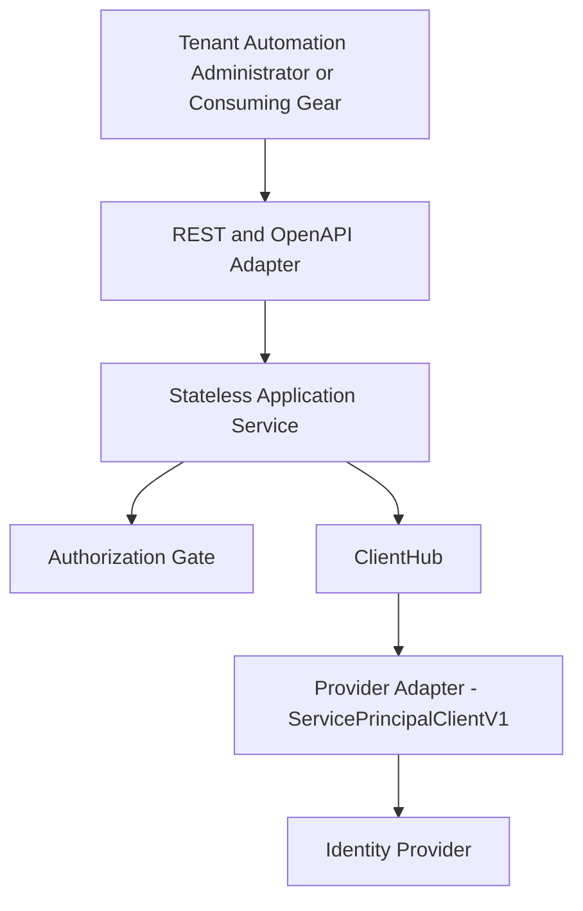
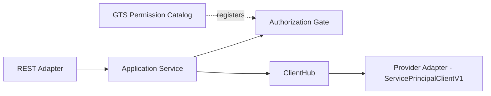
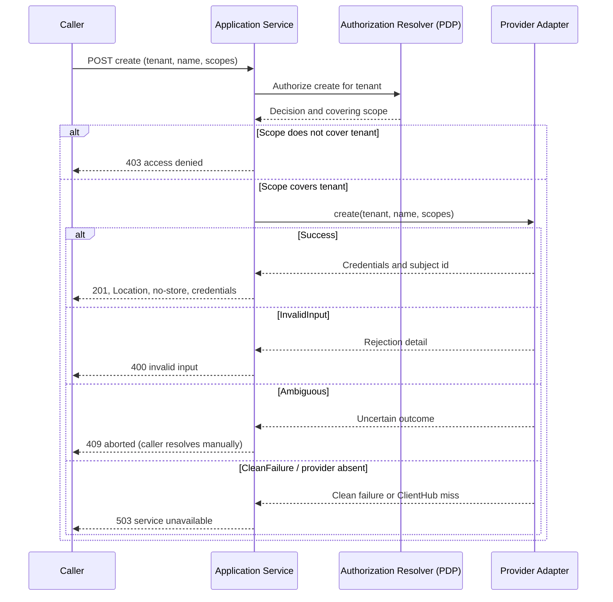
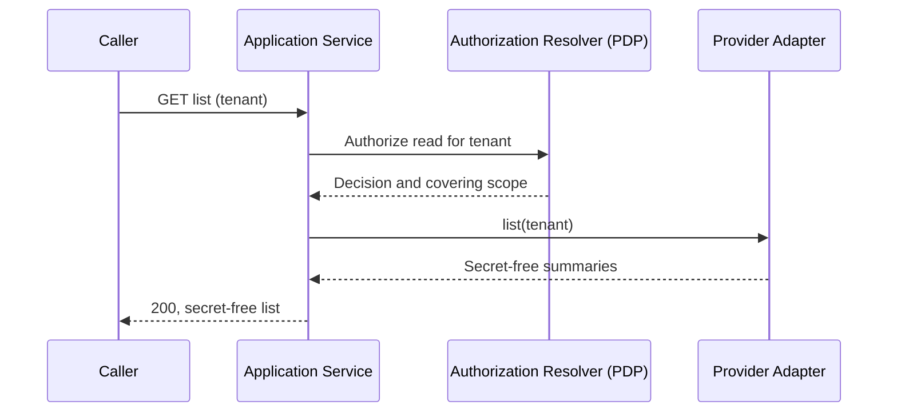
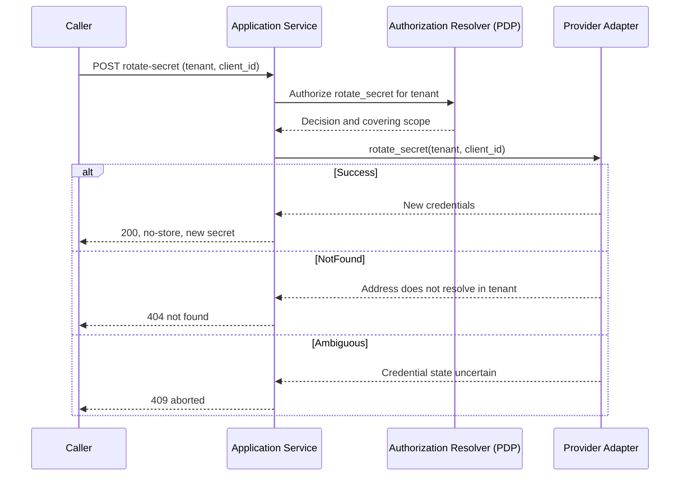
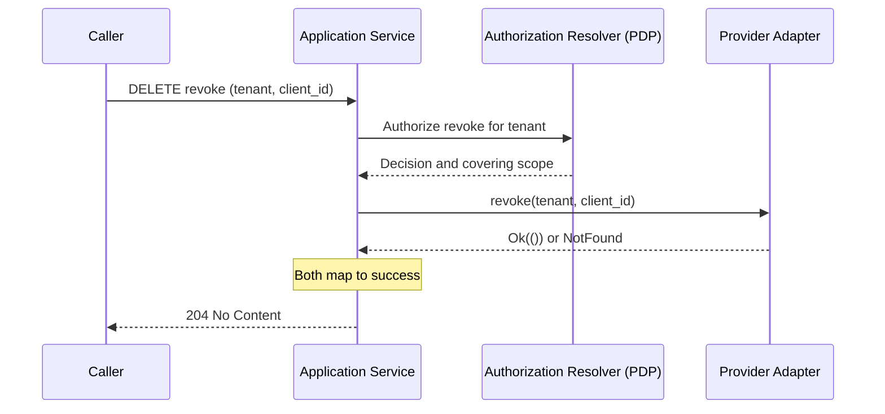
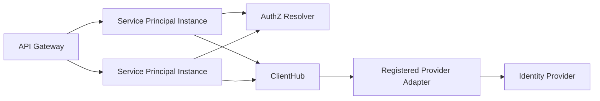

Created: 2026-08-07 by Constructor Studio

# Technical Design — Service Principal

<!-- toc -->

- [1. Architecture Overview](#1-architecture-overview)
  - [1.1 Architectural Vision](#11-architectural-vision)
  - [1.2 Architecture Drivers](#12-architecture-drivers)
  - [1.3 Architecture Layers](#13-architecture-layers)
- [2. Principles & Constraints](#2-principles--constraints)
  - [2.1 Design Principles](#21-design-principles)
  - [2.2 Constraints](#22-constraints)
- [3. Technical Architecture](#3-technical-architecture)
  - [3.1 Domain Model](#31-domain-model)
  - [3.2 Component Model](#32-component-model)
  - [3.3 API Contracts](#33-api-contracts)
  - [3.4 Internal Dependencies](#34-internal-dependencies)
  - [3.5 External Dependencies](#35-external-dependencies)
  - [3.6 Interactions & Sequences](#36-interactions--sequences)
  - [3.7 Database Schemas & Tables](#37-database-schemas--tables)
  - [3.8 Deployment Topology](#38-deployment-topology)
- [4. Additional Context](#4-additional-context)
  - [4.1 Failure Taxonomy and Wire Safety](#41-failure-taxonomy-and-wire-safety)
  - [4.2 Ambiguous Outcome Handling](#42-ambiguous-outcome-handling)
  - [4.3 Configuration](#43-configuration)
  - [4.4 Security and Data Protection](#44-security-and-data-protection)
  - [4.5 Auditability and Observability](#45-auditability-and-observability)
  - [4.6 Fault Tolerance](#46-fault-tolerance)
  - [4.7 Testability and Verification](#47-testability-and-verification)
  - [4.8 Compliance and Privacy Posture](#48-compliance-and-privacy-posture)
  - [4.9 Migration Impact](#49-migration-impact)
  - [4.10 Assumptions and Baseline Deviations](#410-assumptions-and-baseline-deviations)
  - [4.11 Explicit Non-Applicability](#411-explicit-non-applicability)
- [5. Traceability](#5-traceability)
  - [Requirement Allocation Summary](#requirement-allocation-summary)
- [Appendix A: Decision Rationale](#appendix-a-decision-rationale)
  - [No by-id read on the item path](#no-by-id-read-on-the-item-path)
  - [409 for ambiguous outcomes](#409-for-ambiguous-outcomes)
  - [Supersession of pre-port drafts](#supersession-of-pre-port-drafts)

<!-- /toc -->

- [ ] `p1` - **ID**: `cpt-cf-service-principal-design-provider-neutral-facade`

## 1. Architecture Overview

### 1.1 Architectural Vision

Service Principal is a stateless system gear that exposes create, list, rotate-secret, and revoke
operations for tenant-owned machine identities (confidential OAuth 2.0 `client_credentials`
clients). It is a thin authenticated REST facade: it holds no database and starts no background
work. Its only logic is authorization and error mapping.

Per request the gear acts as the local Policy Enforcement Point (PEP). It asks the platform's
Policy Decision Point (PDP), the `authz-resolver` gear, for a decision and a tenant-scoped
constraint through `authz_resolver_sdk::pep::PolicyEnforcer`, verifies that the returned scope
actually covers the explicit target tenant, and only then resolves the registered
`ServicePrincipalClientV1` provider adapter lazily from the `toolkit::ClientHub` and delegates.
The provider adapter is not shipped in this repository; it is a pluggable implementation a
deployment registers.

The identity provider behind the adapter is authoritative for principal existence, credentials,
and token issuance. The adapter enforces name syntax, the scope allowlist, and a best-effort
per-tenant quota; Service Principal performs no independent validation of those fields before
delegating. The adapter's four-category failure taxonomy
(`InvalidInput`/`NotFound`/`CleanFailure`/`Ambiguous`) is mapped, together with the gear's own
`AccessDenied` and `ProviderUnavailable` outcomes, onto canonical RFC-9457 problem responses at
the REST boundary. An ambiguous provider outcome is surfaced as its own distinct failure; the gear
performs no idempotency-key or operation-key based reconciliation of it.

The component and sequence diagrams in this document are warranted because create, list, rotate,
and revoke each cross three independent trust boundaries — the caller, the PDP, and the pluggable
provider — and the diagrams make that boundary crossing explicit.

### 1.2 Architecture Drivers

#### Functional Drivers

| Requirement | Design Response |
|-------------|-----------------|
| `cpt-cf-service-principal-fr-create` | `Service::create` authorizes the `create` action for the explicit tenant, then delegates to `ServicePrincipalClientV1::create`; the REST handler returns `201 Created` with `Location` and `Cache-Control: no-store`. |
| `cpt-cf-service-principal-fr-client-credentials-only` | The SDK request/response models (`CreateServicePrincipalRequest`, `ServicePrincipalCredentials`) carry no field for an interactive or session-based flow. |
| `cpt-cf-service-principal-fr-identity-context` | `CreateServicePrincipalRequest.tenant_id` is forwarded to the adapter; `ServicePrincipalCredentials.subject_id` returns the adapter-assigned subject. |
| `cpt-cf-service-principal-fr-name-policy` | The gear forwards `name` unmodified; the registered adapter enforces bounded syntax and reports a violation as `ServicePrincipalFailure::InvalidInput`. |
| `cpt-cf-service-principal-fr-scope-allowlist` | The gear forwards `scopes` unmodified; the registered adapter enforces its deployment-controlled allowlist and reports a violation as `InvalidInput`. |
| `cpt-cf-service-principal-fr-tenant-quota` | The registered adapter may apply a best-effort maximum-per-tenant check; `Service` performs no counting of its own. |
| `cpt-cf-service-principal-fr-create-collision` | A taken client identifier is reported by the adapter as `InvalidInput`; `Service` never resumes or modifies an existing principal. |
| `cpt-cf-service-principal-fr-list` | `Service::list` authorizes `read` and returns `ServicePrincipalSummary` values in the adapter's own order; the REST handler wraps them in `ListServicePrincipalsResponseDto`. |
| `cpt-cf-service-principal-fr-secret-free-listing` | `ServicePrincipalSummary` and `ServicePrincipalSummaryDto` declare no secret field. |
| `cpt-cf-service-principal-fr-ownership-addressing` | `rotate_secret` and `revoke` take `(tenant_id, client_id)`; the adapter returns `NotFound` for an id that does not resolve within that tenant, without revealing whether it exists under another tenant. |
| `cpt-cf-service-principal-fr-rotate-secret` | `Service::rotate_secret` authorizes `rotate_secret` and returns one new `ServicePrincipalCredentials`; the REST handler returns `200 OK` with `Cache-Control: no-store`. |
| `cpt-cf-service-principal-fr-rotate-complete-state` | An unresolved `client_id` at rotation time is mapped from the adapter's `NotFound` to a `404` canonical problem, never a success. |
| `cpt-cf-service-principal-fr-revoke` | `Service::revoke` authorizes `revoke`, delegates to `ServicePrincipalClientV1::revoke`, and the REST handler returns `204 No Content` carrying no body. |
| `cpt-cf-service-principal-fr-revoke-idempotent` | `Service::revoke` maps both `Ok(())` and `ServicePrincipalFailure::NotFound` to success before any error conversion. |
| `cpt-cf-service-principal-fr-authenticated-management` | All four `OperationBuilder` routes call `.authenticated()`; every handler takes a `SecurityContext` extension. |
| `cpt-cf-service-principal-fr-independent-permissions` | `gts::permissions` declares four `AuthzPermissionV1` instances (`create`, `read`, `rotate_secret`, `revoke`) against the service-principal resource type. |
| `cpt-cf-service-principal-fr-tenant-authorization` | `Service::authorize` builds an `AccessRequest` with `OWNER_TENANT_ID` and `require_constraints(true)`, then `authz::ensure_scope_permits` checks the returned `AccessScope` against the explicit tenant. |
| `cpt-cf-service-principal-fr-authz-fail-closed` | `authz::map_enforcer_err` maps `Denied` and `CompileFailed` to `AccessDenied`, and `EvaluationFailed` to `Upstream`; no branch defaults to allow. |
| `cpt-cf-service-principal-fr-provider-delegation` | Every lifecycle call goes through the versioned `ServicePrincipalClientV1` trait, resolved by `hub.get::<dyn ServicePrincipalClientV1>()`. |
| `cpt-cf-service-principal-fr-provider-required` | `Service::sp_client` maps a `ClientHub` resolution failure to `DomainError::ProviderUnavailable` (`503`), logging the underlying `ClientHubError` rather than simulating success. |
| `cpt-cf-service-principal-fr-failure-categories` | `From<ServicePrincipalFailure> for DomainError` and `From<DomainError> for CanonicalError` together render a distinct, machine-readable problem for each of the six outcomes. |
| `cpt-cf-service-principal-fr-ambiguous-outcome-signaling` | `DomainError::Ambiguous` maps to `409 Aborted` with reason `AMBIGUOUS_OUTCOME`, distinct from the `503` used for `Upstream`/`ProviderUnavailable`. |

#### NFR Allocation

| NFR ID | NFR Summary | Allocated To | Design Response | Verification Approach |
|--------|-------------|--------------|-----------------|----------------------|
| `cpt-cf-service-principal-nfr-secret-confidentiality` | No secret in listings, `Debug`, or cacheable responses | `ServicePrincipalCredentials`, `ServicePrincipalCredentialsDto`, REST handlers | `client_secret` is a `secrecy::SecretString`; the DTO hand-writes a redacting `Debug`; `create`/`rotate_secret` handlers set `Cache-Control: no-store`. | `dto_tests::credentials_debug_redacts_secret`; `models.rs::credentials_debug_hides_secret`; router `no-store` assertions |
| `cpt-cf-service-principal-nfr-data-classification` | Restricted-vs-sensitive field classification | SDK models, DTOs | The secret is a redacting, non-`Serialize` wrapper; client id, subject id, tenant id, and scopes are plain fields carrying no human profile data. | Contract inspection; redaction tests |
| `cpt-cf-service-principal-nfr-no-secret-persistence` | No gear-owned persistence of secrets or state | `domain::service::Service` | `Service` holds only a `PolicyEnforcer` and an `Arc<ClientHub>`; the crate declares no database or storage dependency. | Cargo.toml dependency inspection; `#[domain_model]` compile-time check |
| `cpt-cf-service-principal-nfr-tenant-isolation` | No cross-tenant management success | `domain::authz` | `ensure_scope_permits` denies unless the PDP scope is unconstrained or explicitly covers the target tenant UUID. | `domain/authz.rs` unit tests; `service_tests::create_for_a_different_tenant_than_the_pdp_scope_is_access_denied` |
| `cpt-cf-service-principal-nfr-stateless-recovery` | No authoritative state carried across requests | `ServicePrincipalGear`, `Service` | The gear declares no database, migration, or worker dependency in `Cargo.toml`; every field the `Service` holds is re-usable, not per-request state. | Dependency-graph inspection |
| `cpt-cf-service-principal-nfr-contract-compatibility` | Explicit major-version markers | REST paths, `ServicePrincipalClientV1` | REST paths embed `v1`; the SDK crate name and trait carry `V1`; a breaking change requires a new major surface. | Route and SDK naming inspection |

#### Key ADRs

No ADR artifact exists for this gear. The body sections state the resulting architecture directly;
the rationale behind three of those facts is recorded non-normatively in
[Appendix A](#appendix-a-decision-rationale).

### 1.3 Architecture Layers

- [ ] `p3` - **ID**: `cpt-cf-service-principal-tech-layered-facade`

| Layer | Responsibility | Technology |
|-------|-----------------|------------|
| Presentation | Authenticated routing, DTO conversion, `Location`/`Cache-Control: no-store` headers, RFC-9457 rendering | `axum`, `toolkit::api::OperationBuilder`, OpenAPI |
| Application | Explicit-tenant authorization, provider delegation, outcome mapping | `domain::service::Service`, `authz_resolver_sdk::pep::PolicyEnforcer` |
| Domain | Domain error model, PEP resource type, permission catalog | `domain::error::DomainError`, `domain::authz`, `gts::permissions` |
| Infrastructure | Transport-neutral SDK models and the pluggable provider contract, resolved through `ClientHub` | `service-principal-sdk`, `toolkit::ClientHub` |

## 2. Principles & Constraints

### 2.1 Design Principles

#### Provider Authority

- [ ] `p1` - **ID**: `cpt-cf-service-principal-principle-provider-authority`

The registered identity-provider adapter is the sole authority for principal existence,
credentials, and token issuance. Service Principal copies no provider inventory and retains no
provider state between requests.

#### One-Time Secret Disclosure

- [ ] `p1` - **ID**: `cpt-cf-service-principal-principle-one-time-secret`

A plaintext client secret crosses the public boundary only in the response body of a successful
`create` or `rotate_secret` call. It is never returned by `list`, and a lost secret is recovered
only through a new rotation.

#### Authorize the Explicit Tenant

- [ ] `p1` - **ID**: `cpt-cf-service-principal-principle-explicit-tenant-authorization`

Every request re-authenticates and re-authorizes its explicit target tenant against the PDP
before any provider delegation. A PDP decision that is `true` for a different tenant or a wider
subtree never substitutes for a check against the requested tenant.

#### Delegated Validation, Delegated Reconciliation

- [ ] `p1` - **ID**: `cpt-cf-service-principal-principle-delegated-validation`

Name syntax, scope allowlisting, and per-tenant quota are enforced entirely by the registered
provider adapter. Service Principal performs no independent validation of those fields and
performs no automatic recovery when the adapter reports an ambiguous outcome; recovery is left to
the caller.

#### Stable Contracts, Replaceable Providers

- [ ] `p1` - **ID**: `cpt-cf-service-principal-principle-versioned-contracts`

The REST surface and the `ServicePrincipalClientV1` trait are each versioned, so a conforming
provider adapter can be substituted without changing callers, and a breaking change to either
surface requires a new major version.

### 2.2 Constraints

#### One Provider per Deployment

- [ ] `p1` - **ID**: `cpt-cf-service-principal-constraint-single-provider`

Exactly one `ServicePrincipalClientV1` implementation is resolved from the `ClientHub` per
deployment. Selection does not vary by tenant or by request. No adapter implementation ships in
this repository.

#### No Distributed Transaction

- [ ] `p1` - **ID**: `cpt-cf-service-principal-constraint-no-distributed-transaction`

Service Principal and the registered provider do not share a transaction. Transport uncertainty is
reported by the adapter as `ServicePrincipalFailure::Ambiguous` and surfaced to the caller as a
distinct `409` outcome; the gear applies no retry or reconciliation logic of its own.

#### No Adapter Conformance Harness

- [ ] `p2` - **ID**: `cpt-cf-service-principal-constraint-no-conformance-harness`

This repository defines only the `ServicePrincipalClientV1` trait contract. No shared
cross-adapter conformance test suite exists to validate a second adapter's ownership,
invalidation, or failure-category behavior.

#### Bounded Administrative Workload

- [ ] `p2` - **ID**: `cpt-cf-service-principal-constraint-bounded-workload`

Lifecycle calls are low-frequency administrative operations, not request-path operations. Listing
is unpaginated; the collection size is bounded by whatever quota the registered adapter enforces.

## 3. Technical Architecture

### 3.1 Domain Model

**Technology**: Transport-neutral Rust structs and a `thiserror` domain error enum

**Location**: `gears/system/service-principal/service-principal-sdk/src/models.rs`,
`gears/system/service-principal/service-principal-sdk/src/error.rs`,
`gears/system/service-principal/service-principal/src/domain/error.rs`

- [ ] `p1` - **ID**: `cpt-cf-service-principal-entity-lifecycle-model`

| Entity | Description | Security Classification |
|--------|-------------|--------------------------|
| `CreateServicePrincipalRequest` | Explicit `tenant_id`, caller-chosen `name`, and `scopes` for a create call | Security-sensitive control-plane metadata |
| `ServicePrincipalCredentials` | `client_id`, `client_secret` (`SecretString`), `token_url`, `subject_id` | `client_secret` is restricted; other fields are security-sensitive |
| `ServicePrincipalSummary` | `client_id`, `enabled`, `scopes`; no secret field | Security-sensitive; never contains a secret |
| `ServicePrincipalFailure` | Closed four-variant adapter failure taxonomy: `InvalidInput`, `NotFound`, `CleanFailure`, `Ambiguous` | Security-sensitive operational metadata |
| `DomainError` | Gear-level error enum: `InvalidInput`, `NotFound`, `AccessDenied`, `ProviderUnavailable`, `Upstream`, `Ambiguous` | Security-sensitive operational metadata |

Relationships are bounded as follows:

- `ServicePrincipalCredentials` is produced only by `create` and `rotate_secret`.
- `DomainError` is derived from `ServicePrincipalFailure` (via `From<ServicePrincipalFailure>`) for
  every operation except `revoke`, which treats `NotFound` as success before that conversion runs.
- `DomainError::AccessDenied` and `DomainError::ProviderUnavailable` originate in the gear, not in
  the adapter.
- Service Principal retains none of these values after a request completes.

### 3.2 Component Model

#### REST and OpenAPI Adapter

- [ ] `p1` - **ID**: `cpt-cf-service-principal-component-rest-adapter`

**Purpose**: Expose the stable HTTP contract while keeping HTTP types out of the domain and SDK
layers.

**Responsibilities**:

- Register the four routes in `api::rest::routes::register_routes` through `OperationBuilder`.
- Require `.authenticated()` and register standard errors and OpenAPI schemas for every route.
- Convert DTOs (`api::rest::dto`) at the boundary and add `Location` (create) and
  `Cache-Control: no-store` (create, rotate_secret).
- Render `DomainError` as a canonical RFC-9457 problem via `api::rest::error`.

**Boundaries**: It does not authorize, call the provider adapter directly, persist state, or
expose a single-item `GET` (the item path registers only `rotate-secret` and `DELETE`).

#### Application Service

- [ ] `p1` - **ID**: `cpt-cf-service-principal-component-application-service`

**Purpose**: Enforce authorization before provider delegation and map provider outcomes.

**Responsibilities**:

- Authorize the explicit tenant for `create`, `read`, `rotate_secret`, or `revoke` via
  `domain::service::Service::authorize` before any provider call.
- Resolve `ServicePrincipalClientV1` lazily from the `ClientHub` per call.
- Delegate the four lifecycle operations and map `ServicePrincipalFailure` to `DomainError`.
- Treat a `revoke` against an absent principal as success.

**Boundaries**: It performs no name, scope, or quota validation of its own; it holds no database,
worker, or provider protocol logic.

#### Authorization Gate

- [ ] `p1` - **ID**: `cpt-cf-service-principal-component-authorization-gate`

**Purpose**: Enforce object-level (tenant) authorization for a high-impact machine-identity
resource type.

**Responsibilities**: Build an `AccessRequest` with `pep_properties::OWNER_TENANT_ID` and
`require_constraints(true)`, call `PolicyEnforcer::access_scope_with` against the
`SERVICE_PRINCIPAL` `ResourceType`, and verify with `ensure_scope_permits` that the returned
`AccessScope` covers the explicit tenant UUID (or is unconstrained).

**Boundaries**: It does not author policy, does not infer tenant ownership from a `client_id`
without an authoritative adapter lookup, and exposes no PDP diagnostics on the wire.

#### Provider Adapter Boundary

- [ ] `p1` - **ID**: `cpt-cf-service-principal-component-provider-boundary`

**Purpose**: Isolate provider-specific protocol and authoritative state behind a single trait.

**Responsibilities** (of a conforming, deployment-registered adapter):

- Implement `create`, `list`, `rotate_secret`, and `revoke` for a `(tenant_id, client_id)`-scoped
  resource.
- Enforce name syntax, the scope allowlist, and a best-effort per-tenant quota before mutation.
- Return `NotFound` for an address that does not resolve within the given tenant.
- Return the secret only from `create`/`rotate_secret`.
- Report transport uncertainty as `Ambiguous`, never as success.
- Delete a tenant's principals as part of that tenant's deprovisioning (a documented obligation of
  the SPI contract, not an operation Service Principal exposes or verifies).

**Boundaries**: No adapter implementation ships in this repository; `Service` makes no
authorization decision on the adapter's behalf and exposes no provider diagnostics on the wire.

#### GTS Resource and Permission Catalog

- [ ] `p1` - **ID**: `cpt-cf-service-principal-component-gts-catalog`

The catalog defines the managed-resource type
`gts.cf.core.service_principal.service_principal.v1~` (`SERVICE_PRINCIPAL_RESOURCE_TYPE`,
declared once in the SDK and mirrored by the gear's `ResourceType` and `#[resource_error(...)]`
marker), registered with `types-registry` through the link-time GTS inventory. This type is
distinct from the account-management `user` type and from the deployment-configured
service-subject classification a token carries when it authenticates.

Permissions are well-known instances of `gts.cf.toolkit.authz.permission.v1~`:

| Permission Instance ID | Action |
|-------------------------|--------|
| `gts.cf.toolkit.authz.permission.v1~cf.core.service_principal.create.v1` | `create` |
| `gts.cf.toolkit.authz.permission.v1~cf.core.service_principal.read.v1` | `read` |
| `gts.cf.toolkit.authz.permission.v1~cf.core.service_principal.rotate_secret.v1` | `rotate_secret` |
| `gts.cf.toolkit.authz.permission.v1~cf.core.service_principal.revoke.v1` | `revoke` |

The catalog defines identifiers, not grants or role assignments; role authoring and evaluation
belong to the Authorization Resolver.

### 3.3 API Contracts

#### Service Principal REST V1

- [ ] `p1` - **ID**: `cpt-cf-service-principal-interface-rest-v1`

- **Contracts**: `cpt-cf-service-principal-interface-rest`, `cpt-cf-service-principal-contract-authorization`
- **Technology**: REST, JSON, OpenAPI, RFC-9457 Problem Details
- **Location**: `gears/system/service-principal/service-principal/src/api/rest/routes.rs`

| Method | Path | Request Requirement | Success |
|--------|------|----------------------|---------|
| `POST` | `/service-principal/v1/tenants/{tenant_id}/service-principals` | Authenticated; JSON body `{name, scopes}` | `201 Created`, `Location`, `Cache-Control: no-store` |
| `GET` | `/service-principal/v1/tenants/{tenant_id}/service-principals` | Authenticated | `200 OK` |
| `POST` | `/service-principal/v1/tenants/{tenant_id}/service-principals/{client_id}/rotate-secret` | Authenticated | `200 OK`, `Cache-Control: no-store` |
| `DELETE` | `/service-principal/v1/tenants/{tenant_id}/service-principals/{client_id}` | Authenticated | `204 No Content` |

The item path registers `rotate-secret` and `DELETE` only; there is deliberately no by-id read, and
the SPI exposes none either. `Location` on `create` identifies the created resource without
promising that it answers `GET` (rationale: [Appendix A](#appendix-a-decision-rationale)).

Errors render as canonical RFC-9457 problems: `400` (`InvalidInput`, with a field violation when
the adapter attributes one), `403` (`AccessDenied`), `404` (`NotFound`, rotate-secret only), `409`
(`Ambiguous`, reason `AMBIGUOUS_OUTCOME`), and `503` (`ProviderUnavailable` or `Upstream`). No
recovery-status, reconciliation, or cleanup endpoint is registered.

#### Service Principal Rust SDK and Provider SPI V1

- [ ] `p1` - **ID**: `cpt-cf-service-principal-interface-rust-v1`

- **Contracts**: `cpt-cf-service-principal-interface-rust-sdk`, `cpt-cf-service-principal-contract-provider-adapter`
- **Technology**: Rust SDK crate (`service-principal-sdk`) containing transport-neutral models and
  the `ServicePrincipalClientV1` provider trait resolved via `ClientHub`
- **Location**: `gears/system/service-principal/service-principal-sdk/src/`

The SDK exports `create`/`list`/`rotate_secret`/`revoke` request and response models, `TenantId`
(re-exported from `tenant-resolver-sdk`), the closed `ServicePrincipalFailure` taxonomy, and the
`ServicePrincipalClientV1` trait. It defines no separate public in-process management client for
trusted callers; every caller resolves the same trait. `SecurityContext` is carried on every SPI
method for audit; the SPI itself is not an authorization boundary, so every caller must satisfy
its documented authorization precondition before invocation.

Credential models wrap the secret in `secrecy::SecretString`, which redacts `Debug` and declares
no `Serialize` implementation.

#### Provider Adapter Contract V1

- [ ] `p1` - **ID**: `cpt-cf-service-principal-interface-provider-v1`

- **Contracts**: `cpt-cf-service-principal-contract-provider-adapter`
- **Technology**: Async transport-neutral Rust trait (`ServicePrincipalClientV1`), registered in
  the `ClientHub`
- **Location**: `gears/system/service-principal/service-principal-sdk/src/api.rs`

The trait defines `create`, `rotate_secret`, `revoke`, and `list`. An implementation must address
`(tenant_id, client_id)` as the scoped resource, return `NotFound` for an address outside the
tenant, return the secret only from `create`/`rotate_secret`, and classify transport uncertainty as
`Ambiguous` rather than success. `ServicePrincipalFailure::{CleanFailure, Ambiguous}.detail` is
contractually caller-safe operator text — a short summary an API caller may legitimately see, never
a secret, hostname, connection string, or stack trace. As a defense-in-depth guardrail, the gear
additionally sanitizes that `detail` (stripping control characters, collapsing whitespace, and
capping length) at the `DomainError` conversion boundary before it can reach the wire; the
sanitized text and the original length are logged server-side, so operators keep a diagnostic
signal without exposing raw adapter text.

#### Managed Resource and Permissions

- [ ] `p1` - **ID**: `cpt-cf-service-principal-interface-managed-resource-v1`

- **Contracts**: `cpt-cf-service-principal-interface-managed-resource`
- **Technology**: GTS type schema and permission instances aggregated by `types-registry`
- **Location**: `gears/system/service-principal/service-principal-sdk/src/gts.rs`,
  `gears/system/service-principal/service-principal/src/gts/permissions.rs`

| Action | Purpose |
|--------|---------|
| `create` | Mint a tenant-owned machine identity |
| `read` | List tenant-owned principals |
| `rotate_secret` | Replace an existing principal's secret |
| `revoke` | Remove a principal or confirm absence |

Boundary identifiers use typed GTS IDs generated with `gts_id!`; SQL string matching and handler
branching on raw GTS strings are prohibited.

### 3.4 Internal Dependencies

| Dependency Gear | Interface Used | Purpose |
|-----------------|-----------------|---------|
| `authz-resolver` | `authz_resolver_sdk::pep::PolicyEnforcer` | Evaluate `create`/`read`/`rotate_secret`/`revoke` and compile tenant-scoped constraints |
| `types-registry` | Link-time GTS inventory aggregation | Register the managed-resource type and the four permission instances at startup |
| `tenant-resolver-sdk` | `TenantId` | Supply the canonical tenant identifier type shared by the REST and provider contracts |
| ToolKit runtime (`toolkit`) | `Gear`, `RestApiCapability`, `ClientHub`, `OperationBuilder` | Host the gear, mount REST routes, and resolve the provider adapter |
| `toolkit-canonical-errors` | `CanonicalError`, `resource_error` | Map `DomainError` to RFC-9457 problem responses |

**Dependency Rules** (per project conventions):

- No circular dependencies.
- Inter-gear communication uses only the `authz-resolver-sdk` and `service-principal-sdk` crates,
  never internal types of another gear.
- The provider adapter is resolved through `ClientHub`, not through a direct gear dependency, so it
  stays substitutable.
- `SecurityContext` is propagated from the REST handler through `Service` into every SPI call.

Service Principal declares no database, migration, Secure ORM, task-lease, or stateful-worker
dependency in its `Cargo.toml`.

### 3.5 External Dependencies

#### Identity Provider (via the registered adapter)

- **Contract**: `cpt-cf-service-principal-contract-provider-adapter`

| Dependency Gear | Interface Used | Purpose |
|-----------------|-----------------|---------|
| Registered `ServicePrincipalClientV1` implementation | `ServicePrincipalClientV1` trait | Own authoritative principal, credential, and token-issuance state; enforce name/scope/quota policy |

Only the adapter communicates with the identity provider. This repository defines no adapter
implementation and therefore makes no claim about the adapter's transport, egress gateway, or TLS
posture; those are the registered adapter's responsibility and are outside this gear's dependency
graph.

**Dependency Rules** (per project conventions):

- No circular dependencies.
- Only the provider adapter talks to the external identity provider; `Service` never does so
  directly.
- `SecurityContext` is passed to every SPI call for audit.

### 3.6 Interactions & Sequences

#### Create Workload Identity

**ID**: `cpt-cf-service-principal-seq-create`

**Use cases**: `cpt-cf-service-principal-usecase-create`

**Actors**: `cpt-cf-service-principal-actor-tenant-automation-admin`,
`cpt-cf-service-principal-actor-authz-resolver`, `cpt-cf-service-principal-actor-provider-adapter`

`Service` holds only request-local state. No credential or operation record is written by the
gear; recovery from an ambiguous outcome (for example, `list` then revoke-and-retry) is the
caller's responsibility.

#### Inventory Tenant Principals

**ID**: `cpt-cf-service-principal-seq-list`

**Use cases**: `cpt-cf-service-principal-usecase-list`

**Actors**: `cpt-cf-service-principal-actor-tenant-automation-admin`,
`cpt-cf-service-principal-actor-authz-resolver`

#### Rotate Credential

**ID**: `cpt-cf-service-principal-seq-rotate`

**Use cases**: `cpt-cf-service-principal-usecase-rotate`

**Actors**: `cpt-cf-service-principal-actor-tenant-automation-admin`,
`cpt-cf-service-principal-actor-provider-adapter`

The caller adopts only credentials received in a successful rotation response; the gear never
delivers a secret asynchronously or through a separate lookup.

#### Revoke Workload Identity

**ID**: `cpt-cf-service-principal-seq-revoke`

**Use cases**: `cpt-cf-service-principal-usecase-revoke`

**Actors**: `cpt-cf-service-principal-actor-tenant-automation-admin`

`Service::revoke` treats `Ok(())` and `ServicePrincipalFailure::NotFound` identically as success,
so revoking an already-absent principal is indistinguishable from revoking a present one.

### 3.7 Database Schemas & Tables

- [ ] `p3` - **ID**: `cpt-cf-service-principal-db-state-ownership`

Not applicable: Service Principal declares no schema, table, or migration. It does not lease work,
persist an operation record, or restore state after restart.

| State | Durable Owner | Service Principal Access |
|-------|-----------------|-----------------------------|
| Principal, credential, and token-issuance state | Registered identity-provider adapter | Through `ServicePrincipalClientV1` only |
| Plaintext credential response | No platform persistence owner | Request-local delivery only |

An adapter may use its own durable storage to satisfy the SPI contract, but that storage is
outside this gear's boundary and outside this document's scope.

### 3.8 Deployment Topology

- [ ] `p3` - **ID**: `cpt-cf-service-principal-topology-deployment-neutral`

Instances are horizontally scalable and interchangeable. They require authorization, GTS, and
`ClientHub` wiring, but no database, migration, or work-lease infrastructure. Provider absence
produces an explicit `503`; it is never reported as a simulated success.

## 4. Additional Context

### 4.1 Failure Taxonomy and Wire Safety

- [ ] `p1` - **ID**: `cpt-cf-service-principal-design-failure-taxonomy`

| `DomainError` Variant | Source | HTTP Status | Canonical Reason |
|-------------------------|--------|--------------|---------------------|
| `InvalidInput { detail, field }` | `ServicePrincipalFailure::InvalidInput` | `400` | `INVALID_INPUT`, with a field violation |
| `NotFound` | `ServicePrincipalFailure::NotFound` (surfaces only outside `revoke`) | `404` | Not-found resource error |
| `AccessDenied` | `authz::map_enforcer_err` (`Denied`, `CompileFailed`) or a scope that does not cover the tenant | `403` | `ACCESS_DENIED` |
| `ProviderUnavailable` | No `ServicePrincipalClientV1` registered in `ClientHub` | `503` | Service-unavailable |
| `Upstream { detail }` | `ServicePrincipalFailure::CleanFailure` or `authz::map_enforcer_err`'s `EvaluationFailed` | `503` | Service-unavailable |
| `Ambiguous { detail }` | `ServicePrincipalFailure::Ambiguous` | `409` | `AMBIGUOUS_OUTCOME` |

The taxonomy on both sides of the boundary (`ServicePrincipalFailure` and `DomainError`) is closed:
neither type is `#[non_exhaustive]`, so every match is compile-checked to cover every variant.
`Ambiguous` carries `409`, a status distinct from the `503` used for `Upstream` and
`ProviderUnavailable` (rationale: [Appendix A](#appendix-a-decision-rationale)).
Adapter-supplied `detail` is contractually caller-safe operator text (see §3.3, Provider Adapter
Contract V1); the gear additionally sanitizes it — keeping only ASCII graphic characters, collapsing
whitespace runs, and capping length — at the `DomainError` conversion boundary before it reaches
canonical error rendering, for `InvalidInput` (`detail` and `field`), `CleanFailure`, and
`Ambiguous` alike. For `CleanFailure` and `Ambiguous`, the conversion also emits a `tracing::warn!`
carrying the sanitized text plus the original length (never the raw adapter text — see §4.5). No
adapter-internal diagnostics cross the wire.

### 4.2 Ambiguous Outcome Handling

- [ ] `p1` - **ID**: `cpt-cf-service-principal-design-ambiguous-handling`

The gear defines no idempotency-key or operation-key mechanism. When the registered adapter
reports `Ambiguous`, `Service` forwards it unchanged as `DomainError::Ambiguous`, and the REST
layer renders `409` with reason `AMBIGUOUS_OUTCOME`. The caller is expected to inspect state
through `list` and resolve manually — for example, `revoke` followed by a fresh `create` — since
neither `Service` nor any adapter contract defined here performs automatic reconciliation.
Introducing a caller-supplied key to make an ambiguous create or rotate safely retryable is target
work tracked as an open question in the PRD, not part of the current contract.

### 4.3 Configuration

- [ ] `p3` - **ID**: `cpt-cf-service-principal-design-configuration`

Not applicable: the gear declares no gear-specific configuration section or typed configuration
struct. Name-syntax rules, the scope allowlist, and the per-tenant quota are configuration owned by
the registered provider adapter, not by this gear.

### 4.4 Security and Data Protection

- [ ] `p1` - **ID**: `cpt-cf-service-principal-design-security-boundaries`

Security boundaries are:

1. The platform authenticates REST callers and attaches a validated `SecurityContext` before a
   handler runs (`.authenticated()` on every route).
2. `Service::authorize` requests a PDP decision and verifies, via `ensure_scope_permits`, that the
   returned scope covers the explicit target tenant before any provider call.
3. The registered provider adapter accepts only the provider-neutral SPI and is responsible for
   tenant-qualified ownership checks against its own authoritative state.
4. `secrecy::SecretString` wraps every client secret; `ServicePrincipalCredentialsDto` hand-writes
   a redacting `Debug` so no formatting path exposes the secret.
5. `create` and `rotate_secret` responses carry `Cache-Control: no-store`.

Transport security and any credential handling for the provider's own external calls are the
registered adapter's responsibility; this repository makes no claim about them because no adapter
ships here.

### 4.5 Auditability and Observability

- [ ] `p2` - **ID**: `cpt-cf-service-principal-design-operational-signals`

The gear emits one `tracing::info!` at successful `init` and one `tracing::warn!` when
`Service::sp_client` fails to resolve the provider, logging the underlying `ClientHubError` for
diagnosis. It additionally emits one `tracing::warn!` at each of the `CleanFailure` → `Upstream`
and `Ambiguous` → `Ambiguous` `DomainError` conversion boundaries (see §4.1); both carry the
sanitized `provider_detail` (never the raw adapter text) plus the `original_len` of the
unsanitized detail, so operators retain a bounded diagnostic without secrets or control bytes ever
reaching the logs. The `InvalidInput` conversion sanitizes `detail` and `field` the same way but
emits no `warn!`, since a `400` is caller-attributable input rejection rather than an upstream or
provider-side condition worth flagging. Beyond platform-wide request tracing and canonical-error
correlation, the gear defines no dedicated audit trail, metric, or alert of its own; this matches
the PRD's explicit NFR exclusion for bespoke auditability and observability.

### 4.6 Fault Tolerance

- [ ] `p1` - **ID**: `cpt-cf-service-principal-design-fault-tolerance`

Service Principal fails closed before any provider call when authentication is missing, the PDP
denies the request, constraint compilation fails, or PDP evaluation itself fails. Provider absence
is reported as `503`, never as simulated success. Because `Service` carries no per-request state
across calls, a gear restart loses nothing a caller needs to retry; the caller may reach any
instance and repeat an identical request. The gear applies no automatic recovery for an
`Ambiguous` outcome — see §4.2.

### 4.7 Testability and Verification

- [ ] `p1` - **ID**: `cpt-cf-service-principal-design-test-strategy`

The current test suite, aligned with the repository's unit/service/router split:

- SDK unit tests (`service-principal-sdk/src/models.rs`, `error.rs`, `gts.rs`) cover secret
  redaction in `Debug`, stable failure-category metric labels and `Display` shape, and the
  managed-resource GTS id.
- Domain unit tests (`domain/authz.rs`) cover `ensure_scope_permits` for unconstrained, matching,
  mismatched, and deny-all scopes, and `map_enforcer_err` fail-closed mapping.
- Service tests (`domain/service_tests.rs`) cover authorize-before-provider ordering, tenant-scope
  mismatch denial, provider absence, and idempotent revoke on `NotFound`.
- Permission catalog tests (`gts/permissions_tests.rs`) verify all four permissions register in the
  link-time inventory, carry the SDK resource type, and match their action to their instance-id
  verb.
- DTO tests (`api/rest/dto_tests.rs`) verify secret redaction in `Debug`, unknown-field rejection,
  and the default-empty `scopes` field.
- Router tests (`api/rest/routes_tests.rs`) verify all four operations register in the OpenAPI
  registry and exercise their success and error responses end-to-end through the router.
- Error-mapping tests (`api/rest/error.rs`) verify every `DomainError` variant maps to its expected
  HTTP status and that the resource-error literal matches the SDK's `SERVICE_PRINCIPAL_RESOURCE_TYPE`
  constant.

No cross-adapter provider-conformance suite and no performance benchmark exist in this repository;
both are tracked as open PRD questions rather than as claims of this design.

### 4.8 Compliance and Privacy Posture

- [ ] `p3` - **ID**: `cpt-cf-service-principal-design-compliance-posture`

The gear models machine identities and collects no human profile attributes. Client id, subject
id, tenant id, and scope values remain security-sensitive control-plane metadata; the registered
provider owns any residency or backup posture for the principal records it stores. No
gear-specific regulatory claim is made. This exclusion ceases to apply in deployments where tenant
or account identifiers can identify natural persons; such deployments must apply their
deployment-specific privacy controls.

### 4.9 Migration Impact

- [ ] `p3` - **ID**: `cpt-cf-service-principal-design-migration-impact`

The `service-principal` and `service-principal-sdk` crates are new to this repository. No stored
data migration applies because the gear owns no database. This gear defines no recovery schema,
background worker, cleanup API, or operation-status API (supersession of earlier drafts:
[Appendix A](#appendix-a-decision-rationale)). A future operation-key or idempotency-key retry
mechanism (PRD open question) would need a compatible transition or a new major contract version,
since it is not part of the current REST or SDK contract.

### 4.10 Assumptions and Baseline Deviations

- [ ] `p3` - **ID**: `cpt-cf-service-principal-design-assumptions-deviations`

Assumptions:

- Exactly one conforming `ServicePrincipalClientV1` implementation is registered per deployment;
  none ships with this repository.
- The registered adapter enforces name syntax, scope allowlisting, and quota; this gear performs no
  independent validation.
- The platform attaches a validated `SecurityContext` before a route handler runs.
- Lifecycle operations remain low-frequency administrative calls, not request-path traffic.

Baseline implementation status (not approved production deviations, but the current, verified
state of this codebase):

- There is no single-item `GET`; the collection listing and the `Location` header from `create` are
  the only ways to learn a principal's non-secret state (PRD open question 4).
- There is no idempotency-key or operation-key retry mechanism for an ambiguous create or rotate
  outcome; the caller must resolve it manually (PRD open question 2).
- No cross-adapter conformance harness exists to validate a second adapter (PRD open question 3).
- Nothing in this repository demonstrates that a registered adapter actually deletes a tenant's
  principals on tenant deprovisioning; the obligation is stated in the SPI contract only (PRD open
  question 1).
- No performance or scale benchmark exists in this repository (PRD NFR exclusion).

### 4.11 Explicit Non-Applicability

- Frontend state, responsive design, accessibility, and internationalization are not applicable;
  the capability has no user interface.
- Browser sessions, gear-owned MFA, and gear-owned SSO are not applicable; platform authentication
  owns management-call identity.
- CDN and edge caching are not applicable; credential responses are explicitly non-cacheable.
- Event sourcing, lifecycle event streaming, and broker dead-letter queues are not applicable; this
  gear defines none.
- Databases, schemas, migrations, Secure ORM repositories, task leases, and retry workers are not
  applicable; this gear declares none.
- Gear-owned Terraform, container manifests, service-mesh policy, canary logic, and blue/green
  orchestration are not applicable; the gear is deployment-neutral.
- Tenant-deprovision cleanup orchestration is not applicable to this gear; it is a documented
  obligation of the registered provider adapter, discharged outside this gear's API and outside its
  dependency graph.
- Gear-specific configuration (§4.3) is not applicable; there is no typed configuration section for
  this gear beyond adapter-owned policy.
- A currency-denominated cost budget is not applicable; the gear runs no capacity dimension of its
  own beyond a single authorization check and one delegated provider call per request.
- **Regulatory, data-residency, vendor/licensing, and resource constraints** are not applicable as
  gear-specific constraints: the gear stores no data of its own and is provider-agnostic by
  construction (§2.1 Provider Authority); legacy-system integration does not apply to a newly
  ported gear; and budget, team, and time constraints are inherited from the platform-wide release
  process rather than declared here.

## 5. Traceability

- **PRD**: [PRD.md](./PRD.md)
- **UPSTREAM_REQS**: No upstream requirements artifact exists for this gear.
- **ADRs**: None. The body sections state architecture without embedding decision debates; see
  [Appendix A](#appendix-a-decision-rationale) for non-normative rationale.
- **Features**: No feature artifact exists for this gear.
- **Implementation allocation**: Feature decomposition and code traceability are downstream work.

### Requirement Allocation Summary

| Design Area | PRD Coverage |
|-------------|---------------|
| Stateless architecture and provider boundary | `cpt-cf-service-principal-fr-provider-delegation`, `cpt-cf-service-principal-fr-provider-required`, `cpt-cf-service-principal-interface-rust-sdk`, `cpt-cf-service-principal-contract-provider-adapter`, `cpt-cf-service-principal-nfr-stateless-recovery` |
| REST and Rust provider contracts | `cpt-cf-service-principal-fr-create`, `cpt-cf-service-principal-fr-list`, `cpt-cf-service-principal-fr-rotate-secret`, `cpt-cf-service-principal-fr-revoke`, `cpt-cf-service-principal-interface-rest`, `cpt-cf-service-principal-interface-rust-sdk` |
| Authorization and GTS catalog | `cpt-cf-service-principal-fr-authenticated-management`, `cpt-cf-service-principal-fr-independent-permissions`, `cpt-cf-service-principal-fr-tenant-authorization`, `cpt-cf-service-principal-fr-authz-fail-closed`, `cpt-cf-service-principal-interface-managed-resource`, `cpt-cf-service-principal-contract-authorization` |
| Secret safety and classification | `cpt-cf-service-principal-fr-client-credentials-only`, `cpt-cf-service-principal-fr-identity-context`, `cpt-cf-service-principal-fr-secret-free-listing`, `cpt-cf-service-principal-nfr-secret-confidentiality`, `cpt-cf-service-principal-nfr-no-secret-persistence`, `cpt-cf-service-principal-nfr-data-classification` |
| Input, quota, collision, and ownership | `cpt-cf-service-principal-fr-name-policy`, `cpt-cf-service-principal-fr-scope-allowlist`, `cpt-cf-service-principal-fr-tenant-quota`, `cpt-cf-service-principal-fr-create-collision`, `cpt-cf-service-principal-fr-ownership-addressing`, `cpt-cf-service-principal-fr-rotate-complete-state` |
| Failure handling and ambiguous outcomes | `cpt-cf-service-principal-fr-failure-categories`, `cpt-cf-service-principal-fr-ambiguous-outcome-signaling`, `cpt-cf-service-principal-fr-revoke-idempotent` |
| Tenant isolation | `cpt-cf-service-principal-nfr-tenant-isolation` |
| Compatibility | `cpt-cf-service-principal-nfr-contract-compatibility` |

## Appendix A: Decision Rationale

Non-normative. No ADR artifact exists for this gear, so the rationale behind three architectural
facts stated above is recorded here rather than in the body sections, which state architecture
only. Nothing in this appendix adds, removes, or qualifies a requirement.

### No by-id read on the item path

Adding a single-item `GET` would require a by-id read on the `ServicePrincipalClientV1` trait, an
SDK trait change every registered adapter would have to implement, while the collection `GET`
already enumerates a tenant's full principal set. The `Location` header on `create` therefore
follows RFC 9110 §10.2.2, which requires only that the header identify the created resource, not
that the identified URI answer `GET`. Whether to add a by-id read is tracked as PRD open question
4 (see §4.10).

### 409 for ambiguous outcomes

`Ambiguous` is mapped to `409` rather than to the `503` used for `Upstream` and
`ProviderUnavailable` because `503` invites a naive same-request retry, and a retried create after
an ambiguous create can hit `InvalidInput` ("name taken") when the first attempt in fact succeeded.
`409` signals instead that recovery is caller-driven — `revoke` followed by a fresh `create` — not a
blind retry. Automating that recovery behind a caller-supplied idempotency key is tracked as PRD
open question 2 (see §4.2 and §4.10).

### Supersession of pre-port drafts

Design drafts predating the port of this gear into this repository assumed a recovery schema, a
background worker, a cleanup API, and an operation-status API. None of those exist in the
implementation this document describes, and §3.7, §4.2, and §4.11 state their absence
normatively. This entry records only that the earlier drafts are superseded, so that the body
sections need carry no historical framing.
