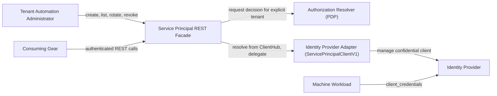

Created: 2026-08-06 by Constructor Studio

# PRD — Service Principal

<!-- toc -->

- [1. Overview](#1-overview)
  - [1.1 Purpose](#11-purpose)
  - [1.2 Background / Problem Statement](#12-background--problem-statement)
  - [1.3 Goals (Business Outcomes)](#13-goals-business-outcomes)
  - [1.4 Glossary](#14-glossary)
- [2. Actors](#2-actors)
  - [2.1 Human Actors](#21-human-actors)
  - [2.2 System Actors](#22-system-actors)
- [3. Operational Concept & Environment](#3-operational-concept--environment)
  - [3.1 Gear-Specific Environment Constraints](#31-gear-specific-environment-constraints)
- [4. Scope](#4-scope)
  - [4.1 In Scope](#41-in-scope)
  - [4.2 Out of Scope](#42-out-of-scope)
- [5. Functional Requirements](#5-functional-requirements)
  - [5.1 Principal Creation](#51-principal-creation)
  - [5.2 Principal Discovery](#52-principal-discovery)
  - [5.3 Credential Rotation and Revocation](#53-credential-rotation-and-revocation)
  - [5.4 Authentication and Authorization](#54-authentication-and-authorization)
  - [5.5 Provider Contract and Failure Handling](#55-provider-contract-and-failure-handling)
- [6. Non-Functional Requirements](#6-non-functional-requirements)
  - [6.1 Gear-Specific NFRs](#61-gear-specific-nfrs)
  - [6.2 NFR Exclusions](#62-nfr-exclusions)
- [7. Public Library Interfaces](#7-public-library-interfaces)
  - [7.1 Public API Surface](#71-public-api-surface)
  - [7.2 External Integration Contracts](#72-external-integration-contracts)
- [8. Use Cases](#8-use-cases)
  - [8.1 Create Workload Identity](#81-create-workload-identity)
  - [8.2 Inventory Tenant Principals](#82-inventory-tenant-principals)
  - [8.3 Rotate a Credential](#83-rotate-a-credential)
  - [8.4 Revoke Workload Identity](#84-revoke-workload-identity)
- [9. Acceptance Criteria](#9-acceptance-criteria)
- [10. Dependencies](#10-dependencies)
- [11. Assumptions](#11-assumptions)
- [12. Risks](#12-risks)
- [13. Open Questions](#13-open-questions)
- [14. Traceability](#14-traceability)

<!-- /toc -->

## 1. Overview

### 1.1 Purpose

Service Principal is a thin, authenticated REST facade that gives authorized administrators tenant-scoped
machine identities for workloads that must authenticate without human credentials. It exposes create, list,
rotate-secret, and revoke operations for confidential OAuth 2.0 `client_credentials` identities, and delegates
every lifecycle operation to a pluggable identity-provider adapter through a versioned Rust trait
(`ServicePrincipalClientV1`) resolved at request time from the platform `ClientHub`.

The gear holds no database, no background workers, and no local business logic beyond authorization and error
mapping. It separates the stable, provider-neutral contract that callers depend on from the identity-provider
specific behavior that an adapter implementation owns.

### 1.2 Background / Problem Statement

Platform workloads need identities for service-to-service access, automation, and unattended jobs. Reusing
human accounts weakens accountability, complicates credential rotation, and ties workload availability to a
person's lifecycle. Direct identity-provider administration also gives every consumer a different integration
surface and error model.

A shared Gears capability is needed to manage machine identities consistently across tenants without binding
consumers to one identity provider. It must keep client secrets out of inventory responses, logs, and caches;
prevent cross-tenant management; and give callers a stable, versioned contract regardless of which provider
adapter a deployment registers.

Service Principal answers this by staying a stateless authorization-and-delegation boundary. The gear itself is
the local Policy Enforcement Point (PEP) for machine-identity management: it asks the platform's external Policy
Decision Point (PDP) whether the caller may perform the action, enforces the returned tenant-scoped decision
against the explicit target tenant, resolves whichever adapter a deployment has registered in the `ClientHub`,
and maps that adapter's outcome to a canonical RFC-9457 response. No adapter implementation ships in this
repository; the SDK crate defines only the contract an adapter must satisfy.

### 1.3 Goals (Business Outcomes)

- Give authorized tenant administrators a REST-only machine-identity lifecycle (create, list, rotate, revoke)
  without direct identity-provider administration.
- Keep the REST contract provider-neutral so a deployment can substitute its identity-provider adapter without
  changing callers.
- Prevent workloads from relying on shared or human credentials by minting dedicated confidential
  `client_credentials` clients per workload.
- Enforce tenant isolation and independently grantable permissions for every management action.
- Keep client secrets out of every non-credential response, log, and cache.

**Success criteria:**

| Measure | Baseline | Initial target | Timeframe |
|---|---:|---:|---|
| Cross-tenant management operations that succeed despite a PDP scope not covering the target tenant | Not measured | 0 | Ongoing, verified by the authorization test suite |
| Client secrets present in list/summary responses or in `Debug`-formatted credential values | Not measured | 0 | Ongoing, verified by DTO and domain tests |
| Successful create/rotate responses that are not marked non-cacheable | Not measured | 0 | Ongoing, verified by the router test suite |
| Revoke calls against an absent principal that return a failure instead of a success-equivalent result | Not measured | 0 | Ongoing, verified by the domain and router test suites |
| REST operations reachable without a validated security context | Not measured | 0 | Ongoing, verified by route registration (`.authenticated()`) |

### 1.4 Glossary

| Term | Definition |
|---|---|
| Service Principal | A tenant-owned, non-human identity used by a workload. |
| Policy Decision Point (PDP) | The platform authorization service (`authz-resolver`) that evaluates an access request and returns a decision together with a tenant-scoped constraint. |
| Policy Enforcement Point (PEP) | The component that requests a decision from the PDP and enforces it before acting. This gear is the PEP for every service-principal management operation. |
| Machine Workload | A service, job, agent, or automation process that authenticates without a human user. |
| Client Credentials | OAuth 2.0 grant in which a confidential client authenticates with its client identifier and secret. |
| Provider SPI (`ServicePrincipalClientV1`) | The versioned Rust trait an identity-provider adapter implements and registers in the `ClientHub`; the gear resolves it lazily per request. |
| Owning Tenant | The tenant that controls a service principal and defines its authorization boundary. |
| Subject ID | The stable identifier carried by the principal's subject claim, used for RBAC bindings. |
| Clean Failure | An SPI failure category in which the provider retained no new state from the operation. |
| Ambiguous Outcome | An SPI failure category in which the provider may have retained state, so the operation cannot be reported as success. |
| One-Time Disclosure | Plaintext secret exposure through the create/rotate-secret responses only. |

## 2. Actors

### 2.1 Human Actors

#### Tenant Automation Administrator

**ID**: `cpt-cf-service-principal-actor-tenant-automation-admin`

- **Role**: An authorized operator who manages machine identities within an allowed tenant scope.
- **Needs**: Create workload identities, inspect their non-secret state, rotate credentials, and revoke access.

A platform administrator can perform the same workflow across broader tenant scopes when platform policy grants
that access (an unconstrained or wider PDP scope). This is not a separate product workflow.

### 2.2 System Actors

#### Machine Workload

**ID**: `cpt-cf-service-principal-actor-machine-workload`

- **Role**: Uses issued credentials to request access tokens through the OAuth 2.0 `client_credentials` grant.
- **Needs**: A stable tenant-scoped identity and valid credentials, with superseded or revoked credentials
  becoming unusable.

#### Authorization Resolver

**ID**: `cpt-cf-service-principal-actor-authz-resolver`

- **Role**: The platform Policy Decision Point (PDP) (`authz-resolver`). The gear, acting as the Policy
  Enforcement Point, asks it whether the caller may perform a given action, and it returns a tenant-scoped
  constraint the gear checks against the explicit target tenant before delegating.

#### Identity Provider Adapter

**ID**: `cpt-cf-service-principal-actor-provider-adapter`

- **Role**: Implements `ServicePrincipalClientV1` and registers itself in the `ClientHub`. Owns authoritative
  principal state, enforces provider-side input policy (name syntax, scope allowlist, per-tenant quota), and
  classifies its own outcomes into the four SPI failure categories. No adapter implementation ships in this
  repository.

#### Consuming Gear

**ID**: `cpt-cf-service-principal-actor-consuming-gear`

- **Role**: Calls the authenticated REST interface to manage service principals as part of a wider platform
  workflow. Behaves like any other authenticated REST caller; the gear defines no separate in-process client for
  trusted callers.

#### Types and Permission Registry

**ID**: `cpt-cf-service-principal-actor-types-registry`

- **Role**: Aggregates, at startup, the managed-resource type and the four permission instances this gear
  declares through the link-time GTS inventory (`types-registry` gear dependency).

## 3. Operational Concept & Environment

Service Principal follows the project-wide Gears and ToolKit baselines in
[ToolKit Architecture & Developer Guide](../../../../docs/toolkit_unified_system/README.md). This PRD records
only capability-specific constraints.

The gear is an administrative control-plane surface with two hard `#[toolkit::gear]` dependencies
(`types_registry`, `authz_resolver`) and one `rest` capability. It holds no database and starts no background
task; per request it acts as the Policy Enforcement Point — obtaining a decision from the external Policy
Decision Point and enforcing it against the explicit tenant — then resolves the registered
`ServicePrincipalClientV1` implementation from the `ClientHub`, delegates, and maps the result to a canonical
response.

The diagram is warranted because the facade, as the Policy Enforcement Point, coordinates three independent trust
boundaries: the caller, the Policy Decision Point, and the pluggable provider.

### 3.1 Gear-Specific Environment Constraints

- A deployment must register one `ServicePrincipalClientV1` implementation in the `ClientHub` before any
  lifecycle operation can succeed; absence is reported as the capability being unavailable rather than as a
  simulated success.
- Name syntax, scope allowlisting, and per-tenant quota are enforced by the registered provider adapter, not by
  this gear; the gear performs no independent validation of those fields before delegating.
- Lifecycle operations are low-frequency administrative operations, not high-volume request-path operations.

## 4. Scope

### 4.1 In Scope

- Tenant-scoped creation of a confidential `client_credentials` service principal via REST, returning a client
  identifier, one-time plaintext secret, token endpoint, and subject identifier.
- Secret-free listing of a tenant's service principals in upstream order (no pagination), identifying each
  principal by the name its creator supplied as well as by its provider-assigned client identifier.
- Secret rotation returning a new one-time secret through a non-cacheable response.
- Idempotent revocation: an already-absent principal is treated as a successful revoke.
- Independent authorization of the `create`, `read`, `rotate_secret`, and `revoke` actions against the explicit
  target tenant.
- A versioned REST management interface and a versioned Rust provider SPI; the gear defines no separate public
  in-process Rust management client.
- Mapping of the SPI's four failure categories (invalid input, not found, clean failure, ambiguous), plus the
  gear's own access-denied and provider-unavailable outcomes, to RFC-9457 canonical error responses.
- Registration of a managed-resource GTS type and four independently grantable permission instances.

### 4.2 Out of Scope

- Human-user identity, password, session, MFA, or interactive-login management.
- Authorization policy authoring, role assignment, or policy-evaluation implementation (owned by the
  Authorization Resolver).
- Long-term credential storage, secret distribution, or workload injection.
- Retrieval of an existing plaintext client secret; the secret is returned only by create and rotate-secret.
- Access-token validation, token exchange, refresh tokens, or authorization-code flows.
- Workload-side token acquisition or token caching.
- Get-by-ID, principal updates, enable/disable, search, filtering, sorting, or pagination.
- Bulk lifecycle operations.
- Multi-provider selection per tenant or request; exactly one adapter is resolved per deployment.
- Provider migration or credential portability.
- A dedicated CLI or graphical management interface.
- A Service Principal-owned principal database, provider-state replica, or retry/reconciliation worker.
- Automatic, idempotency-key or operation-key based retry of ambiguous create/rotate outcomes; the gear surfaces
  an ambiguous outcome as its own distinct failure and leaves recovery to the caller, who reconciles it by
  matching the submitted name in the listing. Correlating an ambiguous create with its principal is in scope
  (§5.2, §5.5); only performing the retry on the caller's behalf is not.
- Name-syntax, scope-allowlist, and quota validation performed by this gear; these are delegated entirely to the
  registered provider adapter.
- Tenant-deprovision cleanup orchestration. Deleting a tenant's principals when that tenant is deprovisioned is
  a documented obligation of the provider SPI contract, discharged by the registered adapter; this gear performs
  no tenant-lifecycle orchestration of its own.
- A common cross-adapter provider-conformance test harness; only the trait contract is defined here.
- Lifecycle event streaming.
- Provider-specific realm, mapper, account, or administration behavior.

## 5. Functional Requirements

> **Testing strategy**: Functional requirements are verified through automated unit, service, and router tests
> in the `service-principal` and `service-principal-sdk` crates unless a requirement states otherwise.

### 5.1 Principal Creation

#### Create Tenant-Owned Service Principal

- [ ] `p1` - **ID**: `cpt-cf-service-principal-fr-create`

The system **MUST** allow an authorized administrator to create a confidential `client_credentials` service
principal owned by an explicit target tenant. A successful creation **MUST** report the new principal's address
and disclose, exactly once, everything the workload needs to authenticate: the client identifier, the plaintext
client secret, the token endpoint, and the subject identifier. That credential-bearing response **MUST NOT** be
cached or stored by intermediaries.

- **Rationale**: Workloads need dedicated non-human credentials and a stable identity for policy bindings.
- **Actors**: `cpt-cf-service-principal-actor-tenant-automation-admin`, `cpt-cf-service-principal-actor-machine-workload`
- **Acceptance Evidence**: `service-principal/src/api/rest/routes_tests.rs::create_returns_201_with_location_and_no_store_and_secret_body`

#### Client Credentials Only

- [ ] `p1` - **ID**: `cpt-cf-service-principal-fr-client-credentials-only`

The system **MUST** create service principals that authenticate only as confidential OAuth 2.0
`client_credentials` identities. The create request and response models carry no field for an interactive or
human authentication flow.

- **Rationale**: Machine identities must remain separate from human login and session semantics.
- **Actors**: `cpt-cf-service-principal-actor-machine-workload`

#### Tenant and Subject Identity Binding

- [ ] `p1` - **ID**: `cpt-cf-service-principal-fr-identity-context`

The system **MUST** pass the explicit target tenant to the provider adapter on create, and the create response
**MUST** return the subject identifier the adapter assigned. Every registered provider adapter is responsible for
issuing tokens that carry that tenant and subject as a non-human identity.

- **Rationale**: Downstream authorization needs an unambiguous tenant and non-human subject classification.
- **Actors**: `cpt-cf-service-principal-actor-machine-workload`, `cpt-cf-service-principal-actor-provider-adapter`

#### Provider-Enforced Name Policy

- [ ] `p2` - **ID**: `cpt-cf-service-principal-fr-name-policy`

The registered provider adapter **MUST** reject a caller-selected principal name that violates its bounded
syntax before any provider mutation. The gear forwards the caller-supplied name unmodified and surfaces the
adapter's rejection as invalid input.

- **Rationale**: Safe, bounded names prevent invalid provider resources and inconsistent public identifiers.
- **Actors**: `cpt-cf-service-principal-actor-tenant-automation-admin`, `cpt-cf-service-principal-actor-provider-adapter`

#### Provider-Enforced Scope Allowlist

- [ ] `p2` - **ID**: `cpt-cf-service-principal-fr-scope-allowlist`

The registered provider adapter **MUST** reject any requested client scope that is not present in its
deployment-controlled allowlist. The gear forwards the caller-supplied scopes unmodified and surfaces the
adapter's rejection as invalid input.

- **Rationale**: Callers must not escalate workload privileges by requesting arbitrary provider scopes.
- **Actors**: `cpt-cf-service-principal-actor-tenant-automation-admin`, `cpt-cf-service-principal-actor-provider-adapter`

#### Provider-Enforced Tenant Quota

- [ ] `p3` - **ID**: `cpt-cf-service-principal-fr-tenant-quota`

The registered provider adapter **MAY** enforce a best-effort maximum number of service principals per tenant
and reject creation once that maximum is reached. The gear neither counts nor enforces a quota itself.

- **Rationale**: A bounded collection limits accidental growth while preserving honest concurrency semantics;
  the gear stays a stateless facade with no principal inventory of its own.
- **Actors**: `cpt-cf-service-principal-actor-tenant-automation-admin`, `cpt-cf-service-principal-actor-provider-adapter`

#### Creation Collision Safety

- [ ] `p1` - **ID**: `cpt-cf-service-principal-fr-create-collision`

The system **MUST** reject a creation request as invalid input when the requested name is already live for the
target tenant, and **MUST NOT** resume, reveal, or modify the existing principal as part of that request. This
holds however the provider derives its own target identifier, and it applies equally to a half-created principal
left behind by an earlier ambiguous outcome. Consequently a tenant and a name together identify at most one live
principal, which is what makes the name a unique correlation key during ambiguous-outcome recovery. Concurrent
creation requests for the same tenant and name **MUST NOT** both succeed.

- **Rationale**: Reusing an existing identity could disclose credentials or attach privileges to the wrong
  workload, and a name that could match more than one live principal would leave a recovering caller unable to
  tell which identity its request produced. Allowing concurrent requests to both succeed would reintroduce that
  same ambiguity by race instead of by sequence.
- **Actors**: `cpt-cf-service-principal-actor-provider-adapter`

### 5.2 Principal Discovery

#### List Tenant Service Principals

- [ ] `p1` - **ID**: `cpt-cf-service-principal-fr-list`

The system **MUST** list the service principals owned by an authorized target tenant, returning each principal's
client id, enabled state, and attached scopes in upstream order. Each listed principal **MUST** additionally be
identified by the name its creator supplied, reported unchanged, so a caller can recognize a principal it asked
for without interpreting the provider-assigned client identifier — including when a creation outcome was
uncertain and the caller must reconcile it.

- **Rationale**: Administrators need inventory for audit, rotation, and revocation workflows, and a caller whose
  creation outcome was uncertain needs a provider-independent way to tell whether its principal exists.
- **Actors**: `cpt-cf-service-principal-actor-tenant-automation-admin`
- **Acceptance Evidence**: `service-principal/src/api/rest/routes_tests.rs::list_returns_200_with_summaries`,
  `service-principal/src/api/rest/routes_tests.rs::list_reports_caller_supplied_name_so_opaque_client_ids_stay_correlatable`

#### Secret-Free Discovery

- [ ] `p1` - **ID**: `cpt-cf-service-principal-fr-secret-free-listing`

The system **MUST NOT** include a client secret field in the listing model or in any future read model derived
from it. The creator-supplied name a listing entry carries for reconciliation is non-secret caller input and
**MUST NOT** be treated as, or replaced by, credential material.

- **Rationale**: Inventory access must not grant credential access, and the field that makes a principal
  recognizable must not become a way to reach its secret.
- **Actors**: `cpt-cf-service-principal-actor-tenant-automation-admin`
- **Acceptance Evidence**: `service-principal/src/api/rest/dto_tests.rs::summary_dto_serializes_caller_supplied_name_verbatim`

#### Ownership-Checked Addressing

- [ ] `p1` - **ID**: `cpt-cf-service-principal-fr-ownership-addressing`

The system **MUST** treat a `client_id` as addressable, for rotate-secret and revoke, only when it resolves
within the explicit target tenant. An address that does not resolve within that tenant **MUST NOT** act on any
principal, and **MUST NOT** disclose whether that id exists under a different tenant.

Authorization for the explicit target tenant is evaluated before any address lookup, so a caller without
permission on that tenant is refused without learning any addressing outcome at all. Past that gate the two
operations express the non-disclosure obligation differently, and both satisfy it: rotate-secret reports
not-found (`cpt-cf-service-principal-fr-rotate-complete-state`), while revoke reports the same indistinguishable
success it reports for an already-absent principal (`cpt-cf-service-principal-fr-revoke-idempotent`). In neither
case can a caller separate "never existed" from "already removed" from "exists under another tenant".

- **Rationale**: Tenant-qualified addressing prevents cross-tenant object access and information leakage. Stating
  the per-operation outcome keeps the non-disclosure rule and the idempotent-revocation rule from reading as
  competing requirements.
- **Actors**: `cpt-cf-service-principal-actor-tenant-automation-admin`, `cpt-cf-service-principal-actor-provider-adapter`

### 5.3 Credential Rotation and Revocation

#### Rotate Secret

- [ ] `p1` - **ID**: `cpt-cf-service-principal-fr-rotate-secret`

The system **MUST** allow an authorized administrator to rotate a tenant-owned principal's secret without
changing its identity. A successful rotation **MUST** disclose the new secret exactly once, in a response that
**MUST NOT** be cached or stored by intermediaries.

- **Rationale**: Workloads need regular and incident-driven credential replacement without replacing their
  identity.
- **Actors**: `cpt-cf-service-principal-actor-tenant-automation-admin`, `cpt-cf-service-principal-actor-machine-workload`
- **Acceptance Evidence**: `service-principal/src/api/rest/routes_tests.rs::rotate_secret_returns_200_with_no_store_and_new_secret`

#### Reject Rotation for an Unresolved Principal

- [ ] `p1` - **ID**: `cpt-cf-service-principal-fr-rotate-complete-state`

The system **MUST** return not-found, rather than succeeding, when the addressed `client_id` does not resolve
within the target tenant at rotation time.

- **Rationale**: Rotation must not issue a credential for a foreign or nonexistent identity.
- **Actors**: `cpt-cf-service-principal-actor-provider-adapter`
- **Acceptance Evidence**: `service-principal/src/api/rest/routes_tests.rs::rotate_secret_not_found_renders_canonical_problem`

#### Revoke Principal

- [ ] `p1` - **ID**: `cpt-cf-service-principal-fr-revoke`

The system **MUST** allow an authorized administrator to revoke a tenant-owned service principal, and **MUST**
report the outcome as a success that carries no principal state and no credential material.

- **Rationale**: Administrators need an immediate way to terminate workload access.
- **Actors**: `cpt-cf-service-principal-actor-tenant-automation-admin`, `cpt-cf-service-principal-actor-machine-workload`
- **Acceptance Evidence**: `service-principal/src/api/rest/routes_tests.rs::revoke_returns_204`

#### Idempotent Revocation

- [ ] `p1` - **ID**: `cpt-cf-service-principal-fr-revoke-idempotent`

The system **MUST** treat revocation of an already-absent principal (a provider not-found outcome) as
indistinguishable from revocation of a present one, not as a failure. That indistinguishability also carries the
non-disclosure obligation of `cpt-cf-service-principal-fr-ownership-addressing`: an address that does not resolve
within the target tenant is reported exactly as one that never existed, so revoke never becomes a probe for
principals owned elsewhere.

- **Rationale**: Cleanup and reconciliation must converge without requiring callers to distinguish concurrent
  deletion from prior success, and the same outcome denies a caller any signal about other tenants' principals.
- **Actors**: `cpt-cf-service-principal-actor-tenant-automation-admin`
- **Acceptance Evidence**: `service-principal/src/domain/service_tests.rs::revoke_is_idempotent_on_not_found`

### 5.4 Authentication and Authorization

#### Authenticated Management

- [ ] `p1` - **ID**: `cpt-cf-service-principal-fr-authenticated-management`

The system **MUST** require a validated platform security context for every management route (`create`, `list`,
`rotate_secret`, `revoke`).

- **Rationale**: Anonymous callers must never manage machine credentials.
- **Actors**: `cpt-cf-service-principal-actor-tenant-automation-admin`, `cpt-cf-service-principal-actor-authz-resolver`

#### Independent Management Permissions

- [ ] `p1` - **ID**: `cpt-cf-service-principal-fr-independent-permissions`

The system **MUST** authorize `create`, `read`, `rotate_secret`, and `revoke` as four independently grantable
GTS permission instances against the service-principal managed-resource type.

- **Rationale**: Credential minting and revocation require narrower delegation than general inventory access.
- **Actors**: `cpt-cf-service-principal-actor-tenant-automation-admin`, `cpt-cf-service-principal-actor-authz-resolver`
- **Acceptance Evidence**: `service-principal/src/gts/permissions_tests.rs`

#### Explicit Tenant Authorization

- [ ] `p1` - **ID**: `cpt-cf-service-principal-fr-tenant-authorization`

The system **MUST** authorize each operation against the explicit owning tenant and verify that the PDP's
returned scope actually covers that tenant (or is unconstrained) before delegating. A decision that is `true`
for a different tenant or subtree **MUST NOT** authorize the explicit target tenant.

- **Rationale**: A broad or mismatched policy decision must not create a broken object-level authorization path.
- **Actors**: `cpt-cf-service-principal-actor-authz-resolver`
- **Acceptance Evidence**: `service-principal/src/domain/service_tests.rs::create_for_a_different_tenant_than_the_pdp_scope_is_access_denied`

#### Fail-Closed Authorization

- [ ] `p1` - **ID**: `cpt-cf-service-principal-fr-authz-fail-closed`

The system **MUST** deny the operation when the PDP denies the request, when constraint compilation fails, or
when policy evaluation itself fails.

- **Rationale**: Security dependency failures must not widen access.
- **Actors**: `cpt-cf-service-principal-actor-authz-resolver`
- **Acceptance Evidence**: `service-principal/src/domain/authz.rs` (`map_enforcer_err` tests)

### 5.5 Provider Contract and Failure Handling

#### Provider-Neutral Delegation

- [ ] `p1` - **ID**: `cpt-cf-service-principal-fr-provider-delegation`

The system **MUST** delegate every lifecycle operation through the versioned `ServicePrincipalClientV1` trait,
resolved lazily per request from the `ClientHub`, so a conforming adapter can be substituted without changing
callers or the REST contract.

- **Rationale**: The Gears capability must not bind consumers to one identity provider.
- **Actors**: `cpt-cf-service-principal-actor-provider-adapter`, `cpt-cf-service-principal-actor-consuming-gear`

#### Provider Absence

- [ ] `p1` - **ID**: `cpt-cf-service-principal-fr-provider-required`

The system **MUST** report the capability as unavailable, without attempting a simulated success, when no
provider adapter is registered in the `ClientHub`.

- **Rationale**: Provider absence means authoritative identity state cannot be created or changed safely.
- **Actors**: `cpt-cf-service-principal-actor-provider-adapter`
- **Acceptance Evidence**: `service-principal/src/domain/service_tests.rs::provider_absent_is_provider_unavailable`

#### Stable Failure Categories

- [ ] `p1` - **ID**: `cpt-cf-service-principal-fr-failure-categories`

The system **MUST** map the SPI's four closed failure categories (invalid input, not found, clean failure,
ambiguous) plus its own access-denied and provider-unavailable outcomes onto canonical RFC-9457 problem
responses, such that a caller can distinguish invalid input, not found, access denied, an unavailable or cleanly
failed provider, and an ambiguous outcome from one another without parsing free text.

- **Rationale**: Callers need a deterministic, machine-readable response for every outcome the provider can
  report.
- **Actors**: `cpt-cf-service-principal-actor-provider-adapter`, `cpt-cf-service-principal-actor-consuming-gear`
- **Acceptance Evidence**: `service-principal/src/api/rest/error.rs::variants_map_to_expected_statuses`

#### Ambiguous Outcome Signaling

- [ ] `p1` - **ID**: `cpt-cf-service-principal-fr-ambiguous-outcome-signaling`

The system **MUST** report a provider outcome the adapter classifies as ambiguous (state may have been retained)
as its own distinct outcome — never as success and never as the same outcome used for a safely retryable
provider failure — so a caller does not blindly retry a request that may have already mutated provider state.
After such an outcome the caller **MUST** be able to determine, against any conforming provider, whether the
principal it asked for now exists: it lists the tenant and looks for the entry bearing the name it submitted, and
then either rotates that principal's secret or revokes it and creates again.

- **Rationale**: A half-applied create or rotation must not be indistinguishable from a transient, safely
  retryable failure, and signaling the uncertainty is only useful if the caller can then resolve it.
- **Actors**: `cpt-cf-service-principal-actor-tenant-automation-admin`, `cpt-cf-service-principal-actor-provider-adapter`

## 6. Non-Functional Requirements

Architecture and engineering conventions are inherited from the
[ToolKit Architecture & Developer Guide](../../../../docs/toolkit_unified_system/README.md) and
[project guidelines](../../../../guidelines/README.md). The requirements below define Service Principal-specific
obligations grounded in the current implementation.

### 6.1 Gear-Specific NFRs

#### Secret Confidentiality

- [ ] `p1` - **ID**: `cpt-cf-service-principal-nfr-secret-confidentiality`

The system **MUST** prevent plaintext client secrets from appearing in list responses or in the `Debug`
representation of any credential-bearing type, and every credential-bearing response **MUST NOT** be cached or
stored by intermediaries.

- **Threshold**: Zero secret disclosures across the DTO redaction tests and zero credential responses that are
  not marked non-cacheable across the router test suite.
- **Rationale**: A leaked client secret grants workload identity until rotation or revocation.
- **Architecture Allocation**: [DESIGN NFR Allocation](./DESIGN.md#nfr-allocation) and
  [Security and Data Protection](./DESIGN.md#44-security-and-data-protection).

#### Data Classification

- [ ] `p1` - **ID**: `cpt-cf-service-principal-nfr-data-classification`

The system **MUST** treat plaintext client secrets as restricted authentication credentials, wrapped in a
redacting, non-serializable secret type. It **MUST** treat client identifiers, subject identifiers, tenant
ownership, and scopes as security-sensitive control-plane metadata, distinct from and never mixed with human
profile attributes.

- **Threshold**: Zero plaintext secret disclosures in debug-formatted output or serialized representations of
  the credential model, verified by the redaction tests.
- **Rationale**: Explicit classification keeps credential handling aligned with actual data sensitivity.
- **Architecture Allocation**: [DESIGN NFR Allocation](./DESIGN.md#nfr-allocation) and
  [Security and Data Protection](./DESIGN.md#44-security-and-data-protection).

#### No Local Secret Persistence

- [ ] `p1` - **ID**: `cpt-cf-service-principal-nfr-no-secret-persistence`

The Service Principal gear **MUST NOT** persist plaintext client secrets or any lifecycle state. The gear's
domain `Service` holds only the PDP `PolicyEnforcer` and a `ClientHub` handle; it declares no database and no
storage dependency.

- **Threshold**: Zero Service Principal-owned tables, files, or caches containing a plaintext or replayable
  credential.
- **Rationale**: The gear is a lifecycle facade, not a credential store.
- **Architecture Allocation**: [DESIGN NFR Allocation](./DESIGN.md#nfr-allocation) and
  [Database Schemas and Tables](./DESIGN.md#37-database-schemas--tables).

#### Tenant Isolation

- [ ] `p1` - **ID**: `cpt-cf-service-principal-nfr-tenant-isolation`

The system **MUST** prevent management operations from crossing unauthorized tenant boundaries, even when the
PDP grants an unconstrained or differently-scoped decision.

- **Threshold**: Zero unauthorized successes in the cross-tenant authorization tests.
- **Rationale**: Machine credentials are high-impact tenant resources.
- **Architecture Allocation**: [DESIGN NFR Allocation](./DESIGN.md#nfr-allocation) and
  [Authorization Gate](./DESIGN.md#authorization-gate).

#### Stateless Recovery

- [ ] `p1` - **ID**: `cpt-cf-service-principal-nfr-stateless-recovery`

The gear **MUST** hold no authoritative principal or session state across requests, so a gear restart requires no
state restoration and loses no in-flight authorization decision.

- **Threshold**: The gear crate declares no database, migration, or stateful-worker dependency.
- **Rationale**: The gear is purely an authorization and provider-delegation boundary; authoritative state, if
  any, belongs to the registered provider adapter.
- **Architecture Allocation**: [Provider Adapter Boundary](./DESIGN.md#provider-adapter-boundary).

#### Contract Versioning

- [ ] `p2` - **ID**: `cpt-cf-service-principal-nfr-contract-compatibility`

The REST surface and the provider contract **MUST** each carry an explicit major-version marker, so a breaking
change requires a new major version rather than an in-place change to the existing surface.

- **Threshold**: Every published management operation and the provider contract expose a major-version marker;
  zero breaking changes are applied in place within a published major version.
- **Rationale**: Callers and adapters must remain independent of unrelated release cadence.
- **Architecture Allocation**: [API Contracts](./DESIGN.md#33-api-contracts).

### 6.2 NFR Exclusions

- **Immediate credential invalidation on rotate/revoke**: Not verified by this codebase. Invalidating the
  superseded credential is the registered provider adapter's responsibility; no adapter ships in this
  repository to test against.
- **Cross-adapter provider conformance suite**: Not applicable today. Only the `ServicePrincipalClientV1` trait
  contract is defined here; a shared conformance harness across multiple adapters does not exist in this
  repository.
- **Bespoke auditability and observability**: Not applicable beyond the project baseline. The gear emits one
  init-time log line and one `warn!` on provider absence; it defines no dedicated audit trail, metrics, or
  alerting beyond platform-wide request tracing and canonical-error correlation.
- **Tenant-deprovision cleanup and retry durability**: Not applicable to this gear. Removing a deprovisioned
  tenant's principals is a documented obligation of the provider SPI contract, owned by the adapter behind
  `ServicePrincipalClientV1`; the gear itself performs no tenant-lifecycle orchestration and keeps no durable
  work queue to retry.
- **Performance and scale benchmarking**: Not measured. No dedicated latency, throughput, or capacity code path
  exists beyond delegating to the registered provider; project-wide platform baselines apply.
- **Scalability targets**: Not applicable because the gear holds no state, runs no background work, and adds no
  capacity dimension of its own — every lifecycle call is a single authorization check plus one delegated
  provider call, so achievable throughput and tenant/principal volume are properties of the registered provider
  adapter and the platform request path, not of this gear. No gear-specific scale target is stated, and none can
  be verified from this codebase.
- **API rate limiting**: Not applicable at the gear level; lifecycle operations are low-frequency administrative
  calls (§3.1), and any rate limiting is enforced by the platform API gateway baseline.
- **Authoritative principal-data RPO and backup**: Not applicable because the provider owns principal records and
  Service Principal owns no principal database.
- **Offline mutation availability**: Not applicable because authoritative lifecycle changes require a reachable
  provider.
- **Physical safety**: Not applicable because this is an information-system control plane with no physical
  actuation.
- **End-user accessibility and internationalization**: Not applicable to this server/API-only capability.
- **Personal-data privacy**: No gear-specific privacy regime applies because the capability processes machine
  identities rather than human profiles. This exclusion ceases to apply in deployments where tenant or account
  identifiers can identify natural persons; such deployments must apply their deployment-specific privacy controls.
- **Data retention and residency**: The identity provider owns principal-record retention and residency;
  Service Principal owns no durable record of its own.
- **Dedicated deployment and release process**: Not applicable; the capability uses the project-wide release
  process.
- **Documentation and support requirements**: Follow the project-wide platform documentation and support
  baseline; no gear-specific deviation.

## 7. Public Library Interfaces

### 7.1 Public API Surface

#### Service Principal REST Interface

- [ ] `p1` - **ID**: `cpt-cf-service-principal-interface-rest`

- **Type**: Versioned authenticated REST API.
- **Stability**: Stable within a major version.
- **Description**: Exposes exactly four operations — create, list, rotate-secret, and revoke — addressed by
  owning tenant and, for rotate-secret and revoke, by client identifier. There is deliberately no single-item
  read: the collection listing and the address returned by create are the only ways to learn a principal's
  non-secret state. Credential-bearing responses are non-cacheable and disclose the plaintext secret exactly
  once.
- **Breaking Change Policy**: A breaking change requires a new major API version and migration guidance.

#### Service Principal Rust Provider Interface

- [ ] `p1` - **ID**: `cpt-cf-service-principal-interface-rust-sdk`

- **Type**: Transport-neutral Rust SDK models and a versioned provider SPI (`ServicePrincipalClientV1`), resolved
  via `ClientHub`.
- **Stability**: Stable within a major version.
- **Description**: Provides the four lifecycle methods (`create`, `list`, `rotate_secret`, `revoke`), a one-time
  credentials model, a secret-free summary model that carries the creator-supplied name alongside the
  provider-assigned client identifier, an explicit `TenantId`, and a closed four-variant failure
  taxonomy (`InvalidInput`, `NotFound`, `CleanFailure`, `Ambiguous`). It is not a public authorization boundary:
  every caller is a trusted platform module that must satisfy the SPI's documented authorization precondition
  before invocation; `SecurityContext` is carried for audit, not enforcement.
- **Breaking Change Policy**: A breaking change requires a new major SDK contract version and migration guidance.

#### Service Principal Managed Resource

- [ ] `p1` - **ID**: `cpt-cf-service-principal-interface-managed-resource`

- **Type**: GTS managed-resource and permission catalog.
- **Stability**: Stable within a major version.
- **Description**: Registers `gts.cf.core.service_principal.service_principal.v1~` as a resource distinct from
  the account-management user type and from the service-principal subject-classification type, and exposes four
  permission instances (`create`, `read`, `rotate_secret`, `revoke`) under
  `gts.cf.toolkit.authz.permission.v1~cf.core.service_principal.<action>.v1`.
- **Breaking Change Policy**: Resource and action identifiers cannot change within a major version.

### 7.2 External Integration Contracts

#### Identity Provider Adapter Contract

- [ ] `p1` - **ID**: `cpt-cf-service-principal-contract-provider-adapter`

- **Direction**: Required from provider implementations, registered in the `ClientHub`.
- **Protocol/Format**: The `ServicePrincipalClientV1` Rust trait.
- **Compatibility**: An adapter must implement all four methods, address `(tenant_id, client_id)` as the scoped
  resource, return `NotFound` for an address that does not resolve within the tenant, return the secret only
  from `create`/`rotate_secret`, report on every listed principal the creator-supplied name unchanged, delete a
  tenant's principals when that tenant is deprovisioned, and report transport uncertainty as `Ambiguous` rather
  than as success. The name obligation keeps reconciliation of an ambiguous create possible for adapters whose
  provider assigns client identifiers the caller cannot predict.

#### Authorization Contract

- [ ] `p1` - **ID**: `cpt-cf-service-principal-contract-authorization`

- **Direction**: Required from the platform Authorization Resolver.
- **Protocol/Format**: An `AccessRequest` carrying the `OWNER_TENANT_ID` resource property and
  `require_constraints(true)`, evaluated through `PolicyEnforcer::access_scope_with`.
- **Compatibility**: The returned `AccessScope` must be checked against the explicit target tenant (or be
  unconstrained) before any provider call proceeds.

## 8. Use Cases

### 8.1 Create Workload Identity

- [ ] `p1` - **ID**: `cpt-cf-service-principal-usecase-create`

**Actor**: `cpt-cf-service-principal-actor-tenant-automation-admin`

**Preconditions**:
- The caller is authenticated and the PDP's returned scope covers the target tenant for the `create` action.
- A `ServicePrincipalClientV1` implementation is registered in the `ClientHub`.
- The requested name and scopes satisfy the registered provider's policy.

**Main Flow**:
1. The administrator submits a name and optional scopes for a tenant-owned service principal.
2. The system authorizes the request, then delegates creation to the registered provider.
3. The system reports the new principal's address and discloses, in a response that must not be cached or stored
   by intermediaries, the client identifier, one-time secret, token endpoint, and subject identifier.
4. The administrator stores the secret immediately, since it is never returned again except by rotation.

**Postconditions**:
- The principal can authenticate as a service subject owned by the target tenant.

**Alternative Flows**:
- **Invalid input** (bad name, disallowed scope, quota exceeded, or a name already live in the tenant): the request is rejected
  as invalid input and no provider state is created.
- **Ambiguous provider outcome**: the system reports the outcome as ambiguous; the caller resolves it manually,
  since the gear performs no automatic reconciliation — it lists the tenant, looks for the principal bearing the
  name it submitted, and then either rotates that principal's secret or revokes it and creates again.

### 8.2 Inventory Tenant Principals

- [ ] `p1` - **ID**: `cpt-cf-service-principal-usecase-list`

**Actor**: `cpt-cf-service-principal-actor-tenant-automation-admin`

**Preconditions**:
- The caller is authenticated and the PDP's returned scope covers the target tenant for the `read` action.

**Main Flow**:
1. The administrator requests the tenant's service-principal inventory.
2. The system returns every principal the registered provider reports for that tenant, each identified by the name
   its creator supplied as well as by its client identifier.
3. The response contains no client secrets.

**Postconditions**:
- The administrator has current non-secret state for audit and lifecycle management, and can recognize a principal
  from the name it was created with even when the client identifier was not predictable.

### 8.3 Rotate a Credential

- [ ] `p1` - **ID**: `cpt-cf-service-principal-usecase-rotate`

**Actor**: `cpt-cf-service-principal-actor-tenant-automation-admin`

**Preconditions**:
- The caller is authorized for the target tenant and the `rotate_secret` action.
- The `client_id` resolves within the target tenant.

**Main Flow**:
1. The administrator requests secret rotation for a `client_id`.
2. The system delegates to the registered provider and discloses the new secret in a response that must not be
   cached or stored by intermediaries.
3. The administrator updates the workload's stored credential.

**Postconditions**:
- The workload can authenticate with the new secret.

**Alternative Flows**:
- **Unresolved principal**: the system reports not found when the `client_id` does not resolve within the target
  tenant.
- **Ambiguous provider outcome**: the system reports the outcome as ambiguous instead of as a silent success or a
  safely retryable provider failure.

### 8.4 Revoke Workload Identity

- [ ] `p1` - **ID**: `cpt-cf-service-principal-usecase-revoke`

**Actor**: `cpt-cf-service-principal-actor-tenant-automation-admin`

**Preconditions**:
- The caller is authorized for the target tenant and the `revoke` action.

**Main Flow**:
1. The administrator requests revocation of a `client_id`.
2. The system delegates to the registered provider.
3. The system concludes successfully, carrying no principal state and no credential material, whether the
   principal was removed or was already absent.

**Postconditions**:
- The addressed principal no longer grants workload access.

**Alternative Flows**:
- **Already absent**: revoking an unknown principal still concludes successfully rather than reporting not found.

## 9. Acceptance Criteria

- [ ] An authorized administrator can complete create, list, rotate-secret, and revoke through the REST contract
      without direct identity-provider administration.
- [ ] Unauthorized and cross-tenant management requests have zero successful outcomes in the authorization test
      suite.
- [ ] Every create and rotate-secret success response is marked as not to be cached or stored by intermediaries,
      and no listing or `Debug` output ever contains a plaintext client secret.
- [ ] A revoke request against an already-absent principal concludes successfully, indistinguishably from a
      revoke against a present one.
- [ ] The SPI's four failure categories plus the gear's access-denied and provider-unavailable outcomes render as
      distinguishable, machine-readable problem responses per the platform's error baseline (RFC-9457).
- [ ] Exactly four management operations (create, list, rotate-secret, revoke) are exposed, and no
      single-principal read operation exists.
- [ ] All four service-principal permission instances (`create`, `read`, `rotate_secret`, `revoke`) are present
      in the GTS link-time inventory and reference the service-principal managed-resource type.
- [ ] A request against a `ClientHub` with no registered provider reports the capability as unavailable rather
      than a simulated success.

## 10. Dependencies

| Dependency | Description | Criticality |
|---|---|---|
| Gears ToolKit runtime (`toolkit`) | Hosts the gear, mounts the REST routes, and provides the `ClientHub` used to resolve the provider adapter. | p1 |
| Authorization Resolver (`authz-resolver`, `authz-resolver-sdk`) | Supplies action decisions and tenant-scoped constraints through `PolicyEnforcer`. | p1 |
| Types and Permission Registry (`types-registry`) | Aggregates the GTS managed-resource type and permission catalog at startup. | p1 |
| Tenant identity contract (`tenant-resolver-sdk::TenantId`) | Supplies the canonical tenant identifier type used across the REST and provider contracts. | p1 |
| Canonical error framework (`toolkit-canonical-errors`) | Maps domain errors to RFC-9457 Problem responses. | p1 |
| API Gateway / OpenAPI registry (`toolkit::api`) | Authenticates and publishes the versioned REST routes. | p1 |
| Identity Provider Adapter (`ServicePrincipalClientV1` implementation) | Owns authoritative principal state and implements the four lifecycle operations; resolved through `ClientHub`, not shipped in this repository. | p1 |
| Platform observability (`tracing`) | Collects the gear's init-time and provider-absence log events. | p3 |

## 11. Assumptions

- The platform authenticates callers and attaches a validated `SecurityContext` before this gear's route
  handlers run.
- The platform supplies a stable `Uuid` tenant identifier used consistently across the authorization and
  provider contracts.
- Exactly one conforming `ServicePrincipalClientV1` implementation is registered in the `ClientHub` per
  deployment; none ships with this repository.
- The registered provider adapter enforces name syntax, scope allowlisting, and quota policy; this gear performs
  no independent validation of those fields.
- Consumers persist a returned client secret immediately, since only create and rotate-secret ever return it.
- Lifecycle operations are low-frequency administrative calls, not request-path operations.

## 12. Risks

| Risk | Impact | Mitigation |
|---|---|---|
| No provider adapter ships with this repository | Lifecycle operations report the capability as unavailable until a deployment registers one | Treat provider absence as an explicit `ProviderUnavailable` failure rather than a simulated success; document the `ClientHub` registration requirement. |
| Ambiguous provider outcomes require manual recovery | Recovery costs the caller extra calls, and it reconciles cleanly only while the provider upholds the name-uniqueness obligation; an adapter that admits two live principals under one name leaves the caller with a conflict it must escalate instead of resolve | Report `Ambiguous` as its own distinct outcome, separate from a safely retryable provider failure, so callers inspect state via `list` rather than retry blindly; require every provider to report the creator-supplied name on that listing and to reject an already-live name, so the caller can identify its principal unambiguously. Residual gaps: no conformance harness validates that a registered adapter actually enforces the uniqueness obligation, and there is no automatic idempotency-key retry. |
| Secret leaks through logs, `Debug`, or caching | An attacker can impersonate a workload | Enforce redacting `Debug` on credential types and ensure every credential-bearing response must not be cached or stored by intermediaries; verified by DTO and router tests. |
| Cross-tenant object access | A caller can manage another tenant's credentials | Authorize the explicit tenant and verify the returned PDP scope actually covers it before any provider call. |
| Name, scope, and quota policy are fully delegated to the provider | Enforcement can vary by adapter implementation | Document the delegation explicitly in the SPI contract so future adapters implement it consistently. |
| Deletion of principals on tenant deprovision is an SPI obligation the adapter alone discharges | An adapter that does not honor the obligation leaves credentials alive after their owning tenant is removed, and the gear cannot detect it | State the obligation normatively in the provider SPI contract; treat verification of adapter conformance as open work before a deployment relies on this gear for tenant offboarding. |
| No cross-adapter conformance suite exists | A future second adapter could diverge in ownership, invalidation, or failure-category behavior | Tracked as future qualification work before a second adapter is accepted. |

## 13. Open Questions

1. **How will a registered adapter's conformance to the SPI obligation to delete a tenant's principals on
   deprovision be verified?** The obligation is stated in the provider SPI contract and the gear performs no
   tenant-lifecycle orchestration, so nothing in this repository demonstrates that an adapter actually honors it.
   - **Owner**: Gears Architecture.
   - **Resolution target**: Before this gear is relied upon for tenant offboarding.

2. **Should create and rotate-secret gain an idempotency or operation-key mechanism to let a caller retry
   automatically after an ambiguous outcome?** Reconciling the outcome by hand is already possible against any
   conforming provider, because a listing identifies each principal by the name its creator supplied; the open
   part is only whether the system should perform the retry on the caller's behalf.
   - **Owner**: Gears Architecture.
   - **Resolution target**: Before a stronger consistency guarantee is offered to callers.

3. **What common provider-conformance suite will validate a second adapter's ownership, invalidation, and
   failure-category behavior?**
   - **Owner**: Provider Integration Owners.
   - **Resolution target**: Before a second adapter is accepted.

4. **Should the REST surface add a single-principal read now that create returns an address for an otherwise
   unreadable resource?**
   - **Owner**: Product and Gears Architecture.
   - **Resolution target**: Before the next breaking API version.

5. **What measured tenant volume should trigger enforced (rather than provider-delegated, best-effort) quota
   semantics?**
   - **Owner**: Product and Capacity Engineering.
   - **Resolution target**: Before raising the supported tenant limit.

## 14. Traceability

- **System slug**: `service-principal`
- **ID prefix**: `cpt-cf-service-principal-*`
- **UPSTREAM_REQS**: No upstream requirements artifact exists for this gear.
- **DESIGN**: [DESIGN.md](./DESIGN.md) allocates the FRs and NFRs above and defines the implementation
  boundaries; DESIGN.md may describe additional target-state architecture beyond what this PRD requires of the
  current implementation.
- **ADRs**: None. This artifact records requirements; DESIGN records the resulting architecture without
  embedding decision debates.
- **DECOMPOSITION**: Not yet authored.
- **FEATURES**: Not yet authored.
- **CODE**: `gears/system/service-principal/service-principal` (gear crate) and
  `gears/system/service-principal/service-principal-sdk` (SDK/SPI crate).
